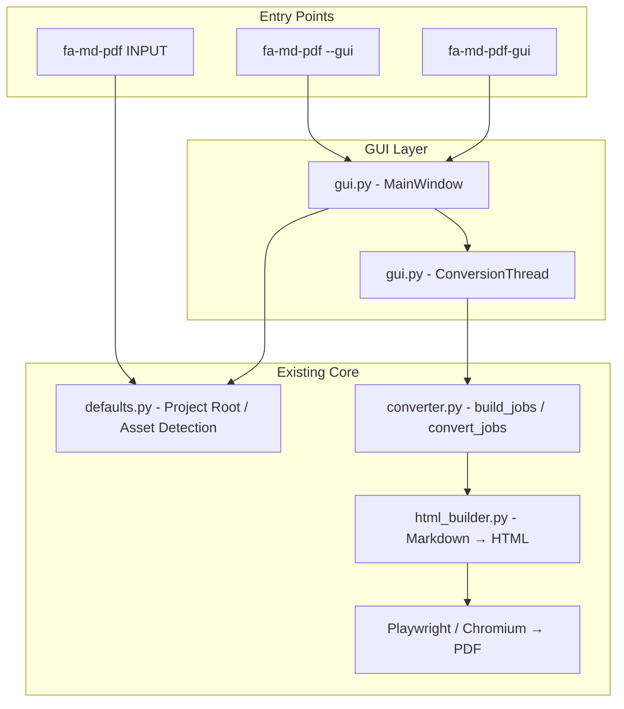
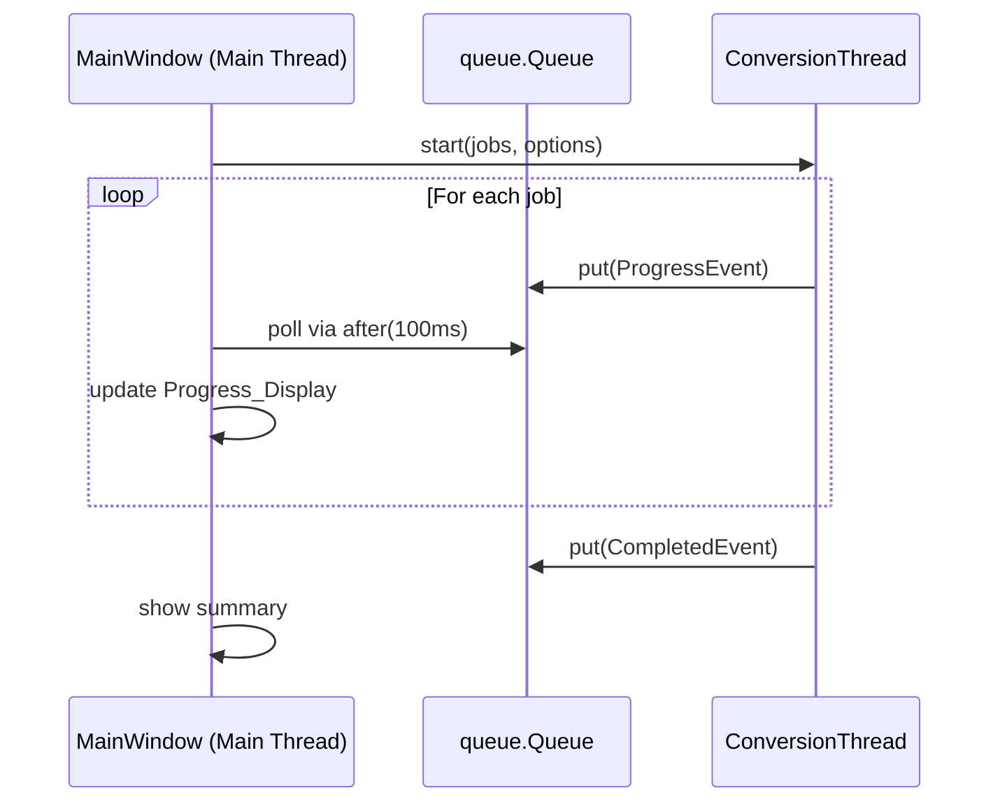
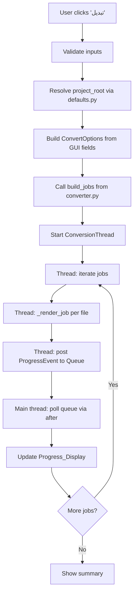
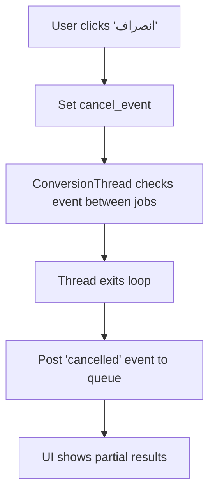

# Technical Design Document

## Introduction

This document describes the technical design for adding a graphical user interface (GUI) to the fa-md-pdf project. The GUI provides a visual alternative to the CLI for all conversion capabilities. It uses Python's built-in `tkinter` library to maintain the project's minimal-dependency and offline-first philosophy.

## Architecture Overview



## Design Decisions

### 1. GUI Toolkit: tkinter

**Rationale:** tkinter is included in the Python standard library on Windows. It requires no additional pip dependencies, aligns with the offline-first philosophy, and supports the RTL text direction needed for Persian interfaces.

**Alternatives considered:**
- PySide6/PyQt6: Professional quality but adds ~100MB dependency
- wxPython: Good native look but requires C++ compilation
- Dear PyGui: Modern but adds external dependency

### 2. Threading Model

The GUI uses a single background thread for conversion to keep the UI responsive:



- `threading.Thread` runs the conversion loop
- `queue.Queue` passes progress events from worker to UI
- `tkinter.after()` polls the queue every 100ms for thread-safe updates
- A `threading.Event` allows cancellation between jobs

### 3. Module Structure

```text
src/fa_md_pdf/
  __init__.py          (unchanged)
  __main__.py          (unchanged)
  cli.py               (add --gui flag)
  converter.py         (unchanged)
  defaults.py          (unchanged)
  html_builder.py      (unchanged)
  gui.py               (NEW - GUI implementation)
  assets/
    default.css        (unchanged)
```

### 4. RTL Support in tkinter

- Set window-level `anchor="e"` for right-aligned widgets
- Use `justify="right"` on Label and Entry widgets
- Pack/grid widgets from right to left where applicable
- Load Vazirmatn font via `tkinter.font.Font` if available on system, fallback to Tahoma/Segoe UI

## Component Design

### MainWindow Class

The primary GUI window containing all panels and controls.

```python
class MainWindow:
    """Main application window with RTL Persian interface."""

    def __init__(self, root: tk.Tk, project_root: Path):
        # Window configuration
        # Input panel (file/directory selection)
        # Output panel
        # Options panel (tabbed: Page, Font, Mermaid, Advanced)
        # Convert/Cancel buttons
        # Progress display (scrollable log)
```

**Layout Structure:**

```text
┌─────────────────────────────────────────────────┐
│  عنوان: fa-md-pdf - تبدیل مارک‌داون به PDF       │
├─────────────────────────────────────────────────┤
│  ── ورودی ──────────────────────────────────── │
│  [مسیر فایل/فولدر ▯▯▯▯▯▯▯▯] [انتخاب فایل] [انتخاب فولدر] │
│  ☑ جستجوی بازگشتی                              │
├─────────────────────────────────────────────────┤
│  ── خروجی ─────────────────────────────────── │
│  [مسیر خروجی ▯▯▯▯▯▯▯▯▯▯▯] [انتخاب...]        │
├─────────────────────────────────────────────────┤
│  ── تنظیمات ───────────────────────────────── │
│  ┌─صفحه─┬─فونت─┬─Mermaid─┬─پیشرفته─┐         │
│  │ فرمت: [A4 ▾]                      │         │
│  │ حاشیه: [15mm]                     │         │
│  │ ☐ افقی                            │         │
│  └───────────────────────────────────┘         │
├─────────────────────────────────────────────────┤
│  [تبدیل]  [انصراف]                              │
├─────────────────────────────────────────────────┤
│  ── نتایج ─────────────────────────────────── │
│  ✓ docs/intro.md → docs/intro.pdf              │
│  ✗ docs/broken.md - خطا: ...                   │
│  ─────────────────────────────────────────────  │
│  نتیجه: ۳ موفق، ۱ ناموفق                       │
└─────────────────────────────────────────────────┘
```

### ConversionThread Class

Background worker that executes conversion jobs and reports progress.

```python
@dataclass
class ProgressEvent:
    event_type: str  # "start" | "success" | "error" | "done"
    job: ConvertJob | None
    total: int
    completed: int
    error: str | None = None

class ConversionThread(threading.Thread):
    """Runs convert_jobs in background, posts ProgressEvents to queue."""

    def __init__(self, jobs, options, progress_queue, cancel_event):
        ...

    def run(self):
        # Iterate jobs, call _render_job equivalent, post events
        # Check cancel_event between jobs
        ...
```

### GUI Entry Point Function

```python
def launch_gui(project_root: Path | None = None) -> None:
    """Create and run the GUI application."""
    root = tk.Tk()
    if project_root is None:
        project_root = find_project_root()
    app = MainWindow(root, project_root)
    root.mainloop()
```

## Integration with Existing Code

### CLI Modification (cli.py)

Add `--gui` flag to the argument parser:

```python
parser.add_argument(
    "--gui",
    action="store_true",
    help="Launch the graphical user interface instead of converting.",
)
```

In `main()`, check for `--gui` before processing other arguments:

```python
if args.gui:
    from .gui import launch_gui
    launch_gui()
    return 0
```

### pyproject.toml Entry Point

Add a separate GUI command:

```toml
[project.scripts]
fa-md-pdf = "fa_md_pdf.cli:main"
fa-md-pdf-gui = "fa_md_pdf.gui:main"
```

### Reuse of Existing Modules

| Module | How GUI Uses It |
|--------|----------------|
| `defaults.py` | `find_project_root()`, `default_*_path()`, `set_playwright_browsers_path()` |
| `converter.py` | `build_jobs()`, `ConvertOptions`, `ConvertJob`, `ConvertResult`, `normalize_extensions()` |
| `converter.py` | Modified `convert_jobs()` or new `convert_jobs_with_callback()` for progress reporting |

### Converter Enhancement for Progress Callbacks

To support real-time progress in the GUI without duplicating logic, add an optional callback parameter:

```python
def convert_jobs(
    jobs: Iterable[ConvertJob],
    options: ConvertOptions,
    fail_fast: bool = False,
    on_progress: Callable[[ConvertJob, bool, str | None], None] | None = None,
) -> list[ConvertResult]:
    ...
    # After each job completes:
    if on_progress:
        on_progress(job, result.ok, result.error)
```

This keeps backward compatibility (CLI doesn't pass the callback) while enabling GUI progress updates.

## Data Flow

### GUI Conversion Flow



### Cancellation Flow



## Error Handling Strategy

| Error Type | GUI Behavior |
|-----------|-------------|
| Missing browsers directory | Show `messagebox.showerror` with setup instructions |
| Missing mermaid.min.js | Show `messagebox.showerror` with file location hint |
| Invalid input path | Inline red label next to input field |
| Single file conversion error | Red entry in progress log, continue batch |
| Unexpected crash in thread | Catch in thread, post error event, show in log |
| Playwright timeout | Show in progress log as failed job |

## File Changes Summary

| File | Change Type | Description |
|------|-------------|-------------|
| `src/fa_md_pdf/gui.py` | NEW | Full GUI implementation (~400-500 lines) |
| `src/fa_md_pdf/cli.py` | MODIFY | Add `--gui` flag, early return to launch GUI |
| `src/fa_md_pdf/converter.py` | MODIFY | Add optional `on_progress` callback to `convert_jobs` |
| `pyproject.toml` | MODIFY | Add `fa-md-pdf-gui` entry point |
| `tests/test_gui.py` | NEW | Unit tests for GUI helper functions |

## Testing Strategy

- Unit test GUI helper functions (option building, path validation) without launching tkinter
- Unit test ConversionThread with mock jobs and queue
- Integration test: verify `--gui` flag is accepted by argument parser
- Manual test: launch GUI, select files, run conversion on Windows
