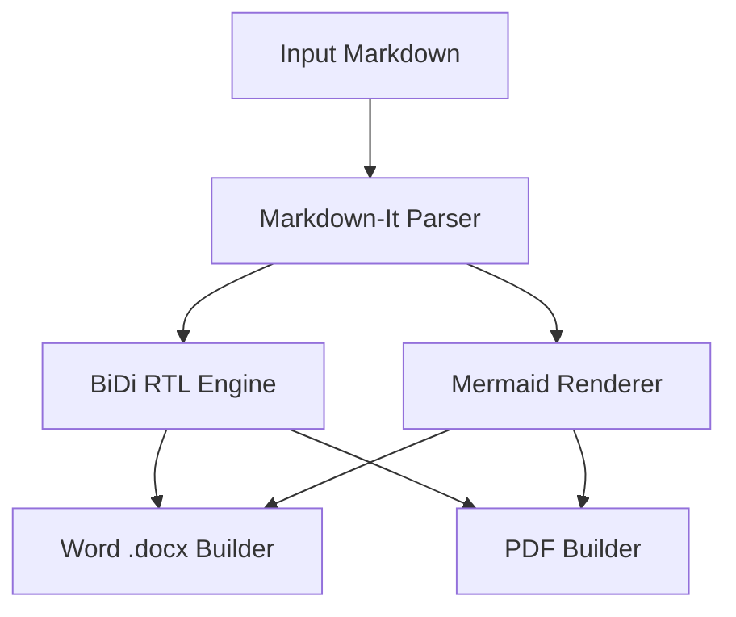

<div align="center">

# MdPersia
### The Modern, Offline-First Persian & RTL Markdown to Word (DOCX) and PDF Converter

[](https://github.com/hamid-morsali-786/MdPersia/stargazers)
[](https://github.com/hamid-morsali-786/MdPersia/network/members)
[](LICENSE)
[](https://python.org)
[](https://github.com/hamid-morsali-786/MdPersia/actions)
[](CONTRIBUTING.md)

<p align="center">
  <b>Developed &amp; Maintained by:</b> <a href="https://github.com/hamid-morsali-786">hamid-morsali-786</a>
</p>

[فارسی](README.md) | **English**

<br/>

<p align="center">
  
</p>

</div>

---

## Table of Contents

- [Overview & Why MdPersia?](#why-mdpersia)
- [Key Features](#features)
- [Feature Comparison Matrix](#comparison-matrix)
- [Comprehensive Markdown Formatting Guide](#comprehensive-markdown-formatting-guide)
  - [Callouts & Admonitions](#callouts--admonitions)
  - [Code Highlighting (Pygments)](#code-highlighting-pygments)
  - [Advanced RTL Tables](#advanced-rtl-tables)
  - [Page Breaks for Printing](#page-breaks-for-printing)
  - [Emoji & Symbol Typography](#emoji--symbol-typography)
- [Full Mermaid Diagrams Showcase](#full-mermaid-diagrams-showcase)
- [Microsoft Word (DOCX) Deep Dive](#microsoft-word-docx-deep-dive)
- [Vector PDF Deep Dive](#vector-pdf-deep-dive)
- [Installation](#installation)
- [Quick Start & CLI Workflows](#quick-start--cli-workflows)
- [Desktop Application (GUI)](#desktop-application-gui)
- [Comprehensive CLI Options Reference](#comprehensive-cli-options-reference)
- [Python API Reference](#python-api-reference)
- [CI/CD & Enterprise Automation](#cicd--enterprise-automation)
- [Architecture](#architecture)
- [Star History](#star-history)
- [Contributing & License](#contributing)

---

## Why MdPersia?

Writing technical documentation in Markdown is the industry standard. However, converting Markdown documents containing **Persian / Arabic (RTL)** text into publication-ready **PDF** or **Microsoft Word (DOCX)** formats has long been notoriously frustrating:

- ❌ **Flipped Punctuation & Mixed Direction**: In tools like Pandoc or traditional VS Code extensions, mixed English terminology, numbers, code tokens, and parentheses `()` frequently flip or become misaligned.
- ❌ **Broken Word (DOCX) RTL Layouts**: Standard converters generate left-to-right Word files where text clings to the wrong margin and tables are inverted.
- ❌ **Failed Mermaid Diagram Rendering**: Architecture diagrams and flowcharts either fail completely or require online network connections.

**MdPersia** solves all of these challenges. Equipped with a dedicated dual-engine pipeline (Chromium vector printing for PDF and a native Office XML generator for Word), MdPersia produces publication-grade documents with flawless BiDi text direction, beautiful **Vazirmatn** Persian typography, and crystal-clear embedded diagrams.

---

## Features

- 📑 **Dual Native Outputs**: Simultaneously produce fully editable, RTL-structured **Word (.docx)** files and vector-grade **PDFs**.
- 📊 **First-Class Mermaid Support**: Seamless offline rendering for Flowcharts, Sequence Diagrams, Class Diagrams, State Diagrams, Gantt Charts, and Pie Charts.
- ⚡ **100% Offline-First Architecture**: Zero external CDN calls. Local Chromium binaries, Vazirmatn fonts, and local Mermaid scripts work entirely air-gapped.
- 🔄 **Real-Time Watch Mode (`-w` / `--watch`)**: A lightweight daemon automatically recompiles documents the moment you press `Ctrl+S` in your editor.
- 📁 **Batch Directory Processing**: Converts entire folders and subfolders while preserving directory hierarchies.
- 🪄 **Intelligent Markdown Repair (`--wrap-rtl`)**: Automatically wraps Persian paragraphs with `<div dir="rtl">` without touching code blocks or existing markup.
- 🖥️ **Modern Desktop GUI (Tauri)**: A responsive 3-pane workbench with light/dark theme switching, real-time logging, and parameter inspection.

---

## Comparison Matrix

| Feature | MdPersia | Pandoc + XeLaTeX | VS Code Markdown-PDF | Typora Export |
| :--- | :---: | :---: | :---: | :---: |
| **Persian / RTL Accuracy** | **Flawless (Native)** | Complex Config | Inconsistent | System-dependent |
| **Native Word (.docx) RTL** | **Yes (Full RTL)** | Basic / LTR Defaults | No | Basic |
| **Offline Mermaid Diagrams** | **Built-in & Auto** | Requires Filters | Requires Internet | Editor-dependent |
| **Zero External Setup** | **Yes (Standalone)** | Requires >4GB TeXLive | Requires Extension | Closed Source |
| **Batch Folder Processing** | **Yes** | Manual Scripting | Manual | No |
| **Live Watch Daemon** | **Yes (`-w`)** | No | No | No |
| **Graphical User Interface** | **Yes (GUI included)** | No | Editor GUI | Editor GUI |

---

## Comprehensive Markdown Formatting Guide

### Callouts & Admonitions
Highlight important notes, tips, and warnings using GitHub Callout syntax. They render as shaded, thick-bordered boxes in both PDF and Word:

```markdown
> [!NOTE]
> General background context, extra notes, or complementary information.

> [!TIP]
> Pro-tip: Use the A4 format and default options for optimal performance.

> [!IMPORTANT]
> Essential requirement: These settings apply across all subfolders.

> [!WARNING]
> Warning: Overwriting files with the same name replaces existing content.

> [!CAUTION]
> Security notice: Never store sensitive credentials or keys in source files.
```

### Code Highlighting (Pygments)
Code blocks are highlighted via **Pygments** with strict LTR isolation and `Consolas` monospace font:

````markdown
```python
def process_documents(file_paths: list[str]) -> int:
    """Process Persian markdown files into DOCX and PDF."""
    return len(file_paths)
```
````

### Advanced RTL Tables
- In **Word (DOCX)**: Table direction is set to Right-to-Left (`w:bidiVisual`), header rows repeat across pages (`w:tblHeader`), with clean borders and alternating row shading.
- In **PDF**: Tables adapt to page width with proper padding and text wrapping.

```markdown
| Module Name | Output Format | Status | Details |
| :--- | :---: | :---: | :--- |
| `html_builder` | PDF | Active | Vector rendering via Chromium |
| `docx_builder` | DOCX | Active | Office Open XML generation |
| `mermaid` | PNG/SVG | Active | Offline high-resolution rendering |
```

### Page Breaks for Printing
Force a new page in both PDF and Word by placing either tag:

```html
<hr class="page-break">
```

### Emoji & Symbol Typography
- In Word, emojis render cleanly using `Segoe UI Emoji`.
- Use `--strip-emojis` to remove emojis from formal/academic documents while fully preserving Persian typography and **zero-width non-joiners (ZWNJ)**.

---

## Full Mermaid Diagrams Showcase

MdPersia renders all standard Mermaid diagrams into sharp retina PNG images for Word and vector graphics for PDF.



---

## Microsoft Word (DOCX) Deep Dive

MdPersia generates native OpenXML documents with:
1. **Full RTL Page View**: Paragraphs, lists, and tables align to the right margin.
2. **Dedicated Persian Fonts**: `Vazirmatn` as primary, `Tahoma` as fallback, and `Consolas` for code.
3. **Automatic Footer Numbering**: Formatted page numbers ("صفحه X از Y") embedded in document footers.
4. **Resolution Scaling**: Control diagram sharpness with `--docx-image-scale 1..4`.
5. **Dimensions Clamping**: Set minimum/maximum diagram widths with `--docx-image-min-width 4.0` and `--docx-image-max-width 6.5`.

---

## Vector PDF Deep Dive

PDF generation uses Headless Chromium for crisp vector printing:
1. **Paper Formats**: Supports `A4`, `Letter`, `Legal`, `A3`, `A5` via `--page-format`.
2. **Page Margins**: Precise margins with `--margin 15mm` (supports `mm`, `in`, `px`).
3. **Landscape Layout**: Produce wide documents via `--landscape`.
4. **Custom Fonts**: Embed custom `.ttf` fonts with `--font-file` or `--font-dir`.
5. **Custom CSS**: Inject your own styling rules with `--css custom.css`.
6. **HTML Debugging**: Retain intermediate HTML with `--keep-html`.

---

## Installation

### Via pip
```bash
pip install mdpersia
```

### From Source (Development)
```bash
git clone https://github.com/hamid-morsali-786/MdPersia.git
cd MdPersia

# Create virtual environment
python -m venv .venv
source .venv/bin/activate  # Windows: .\.venv\Scripts\Activate.ps1

pip install -e ".[dev]"
```

### Headless Chromium Setup
```bash
python -m playwright install chromium
```

---

## Quick Start & CLI Workflows

### Convert a single file to PDF
```bash
mdpersia ./docs/report.md
```

### Convert to Microsoft Word (DOCX)
```bash
mdpersia ./docs/report.md -f docx
```

### Batch convert an entire directory to custom destination
```bash
mdpersia ./docs -o ./output-folder -f docx
```

### Live Watch Mode
```bash
mdpersia ./docs/report.md -w -f pdf
```

### Automatically Wrap Existing Markdown Files
```bash
mdpersia ./notes --wrap-rtl
```

---

## Desktop Application (GUI)

Launch the visual application with:
```bash
mdpersia --gui
```
*Or double-click `run_gui.bat` on Windows.*

Features:
- **Batch Document Queue**: Drag & drop files and view processing progress.
- **5-Tab Inspector**: Configure Document, Style, Mermaid, Word, and Advanced options.
- **Console & Markdown Preview**: Real-time log streaming and instant preview.
- **Theme Support**: Seamless Light & Dark mode switching.

<p align="center">
  
</p>

---

## Comprehensive CLI Options Reference

| Option | Type | Default | Description |
| :--- | :---: | :---: | :--- |
| `input` | Path | Current Dir | Input Markdown file or directory |
| `-o, --output` | Path | Alongside | Output file or destination directory |
| `-f, --format` | Choice | `pdf` | Output format: `pdf` or `docx` |
| `-w, --watch` | Flag | `False` | Watch input file/folder for live updates |
| `--gui` | Flag | `False` | Launch visual desktop interface |
| `--docx-image-scale` | 1-4 | `3` | Mermaid diagram resolution scale for Word |
| `--docx-image-min-width` | Float | `4.0` | Minimum diagram width in Word (inches) |
| `--docx-image-max-width` | Float | `6.5` | Maximum diagram width in Word (inches) |
| `--docx-font-size` | Int | `12` | Body text font size in points |
| `--page-format` | String | `A4` | PDF page size (`A4`, `Letter`, `Legal`, `A3`) |
| `--margin` | String | `15mm` | PDF page margins (`10mm`, `1in`, `20px`) |
| `--landscape` | Flag | Portrait | Generate landscape orientation documents |
| `--strip-emojis` | Flag | `False` | Strip emojis while preserving Persian ZWNJ |
| `--recursive` | Flag | `True` | Recursively scan subfolders for markdown |
| `--no-recursive` | Flag | - | Only convert files directly in input folder |
| `--extensions` | List | `.md .markdown` | Recognized markdown file extensions |
| `--font-family` | String | Vazirmatn | CSS font-family stack |
| `--font-file` | Path | - | Custom local font file |
| `--font-dir` | Path | `./fonts` | Directory containing Vazirmatn fonts |
| `--css` | Path | - | Custom stylesheet file |
| `--mermaid-theme` | Choice | `default` | Mermaid theme (`default`, `base`, `dark`, `forest`) |
| `--mermaid-timeout` | Int | `30000` | Diagram render timeout (milliseconds) |
| `--ignore-mermaid-errors` | Flag | `False` | Continue conversion if Mermaid fails |
| `--browsers-path` | Path | `./browsers` | Custom Playwright browsers path |
| `--keep-html` | Flag | `False` | Retain intermediate HTML file |
| `--fail-fast` | Flag | `False` | Abort batch conversion on first error |
| `--verbose` | Flag | `False` | Detailed logging output |
| `--wrap-rtl` | Flag | `False` | Inject `<div dir="rtl">` wrappers into markdown |
| `--wrap-rtl-suffix` | String | `.rtl` | Output suffix for wrapped markdown |

---

## Python API Reference

```python
from pathlib import Path
from mdpersia import build_jobs, convert_jobs, ConvertOptions, ConversionError

options = ConvertOptions(
    output_format="docx",
    font_family='"Vazirmatn", sans-serif',
    page_format="A4",
    margin="15mm",
    docx_font_size_pt=12,
    docx_image_scale=3,
    include_page_numbers=True,
    strip_emojis=False
)

jobs = build_jobs(
    input_path=Path("./docs/architecture.md"),
    output=Path("./dist/architecture.docx"),
    options=options
)

try:
    results = convert_jobs(jobs, options=options, fail_fast=True)
    print(f"Conversion completed successfully: {len(results)} jobs.")
except ConversionError as err:
    print(f"Conversion error: {err}")
```

---

## CI/CD & Enterprise Automation

```yaml
name: Compile Documents

on:
  push:
    branches: [ main ]

jobs:
  build-docs:
    runs-on: ubuntu-latest
    steps:
      - uses: actions/checkout@v4
      - uses: actions/setup-python@v5
        with:
          python-version: '3.11'
      - name: Install MdPersia
        run: |
          pip install mdpersia
          python -m playwright install chromium
      - name: Compile PDF and Word Documentation
        run: |
          mdpersia docs/ -o dist/pdf/ -f pdf
          mdpersia docs/ -o dist/docx/ -f docx
      - name: Upload Artifacts
        uses: actions/upload-artifact@v4
        with:
          name: compiled-docs
          path: dist/
```

---

## Star History

[](https://star-history.com/#hamid-morsali-786/MdPersia&Date)

---

## Contributing

We welcome contributions from the community!  
Please see our [Contributing Guide](CONTRIBUTING.md) and [Code of Conduct](CODE_OF_CONDUCT.md).

---

## Author & License

Created and maintained with ❤️ by **[Hamid Morsali](https://github.com/hamid-morsali-786)**.

Licensed under the **[MIT License](LICENSE)**.
