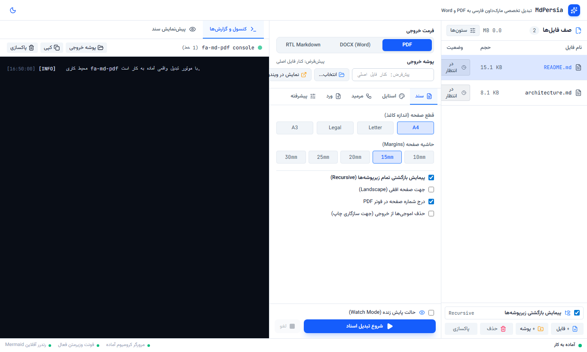
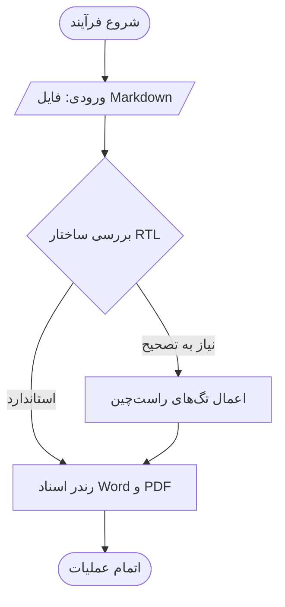
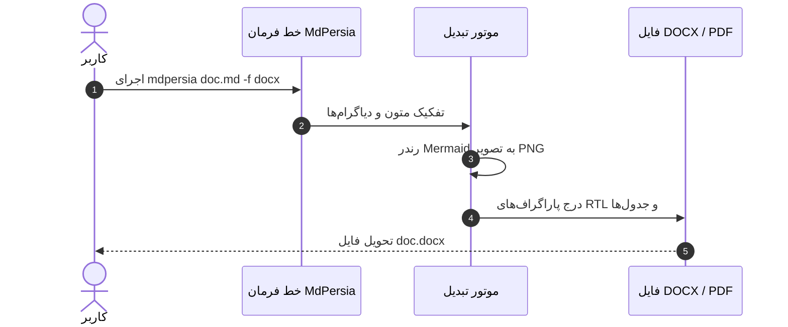
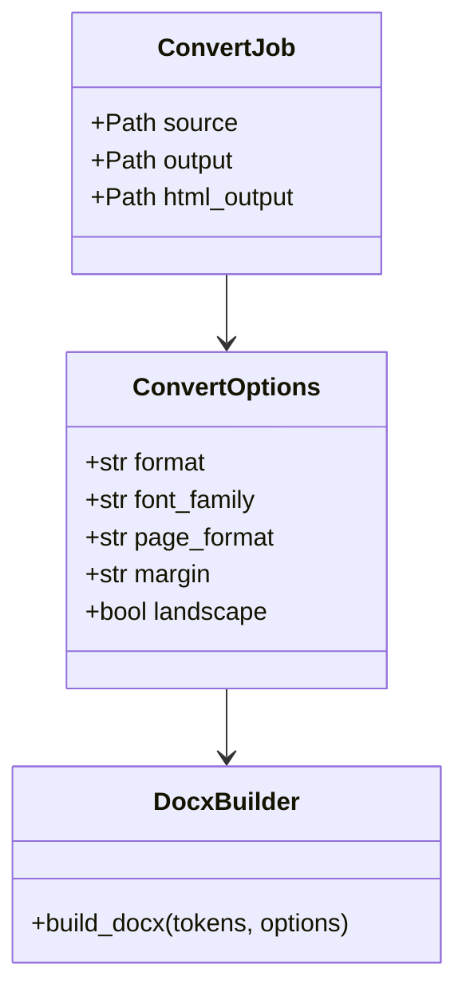
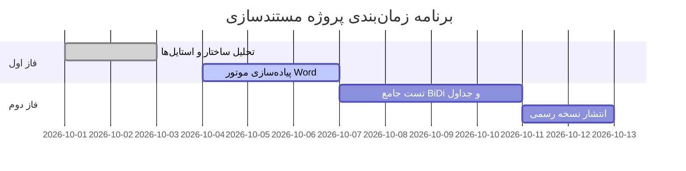
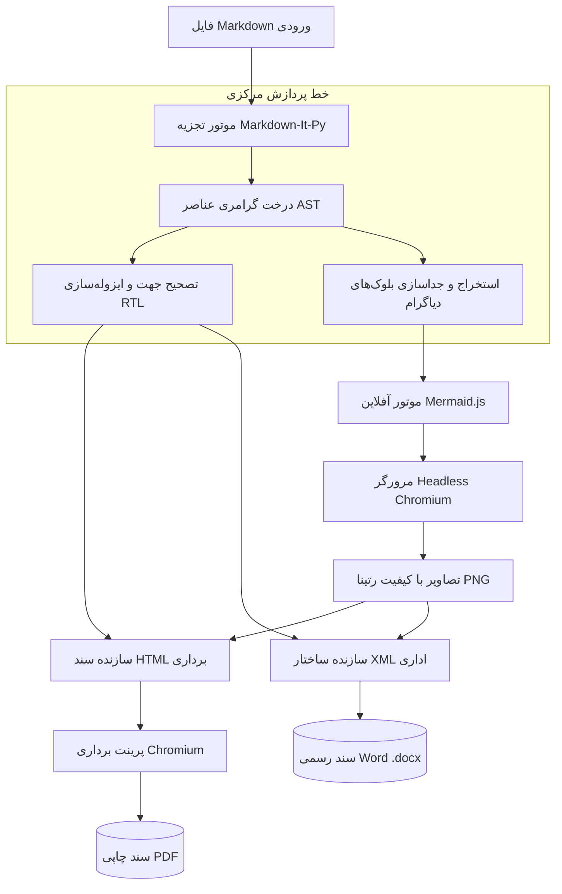

<div align="center">

# مدپرشیا (MdPersia)
### ابزار مدرن، آفلاین و تخصصی تبدیل اسناد Markdown فارسی و RTL به Word (DOCX) و PDF

[](https://github.com/hamid-morsali-786/MdPersia/stargazers)
[](https://github.com/hamid-morsali-786/MdPersia/network/members)
[](LICENSE)
[](https://python.org)
[](https://github.com/hamid-morsali-786/MdPersia/actions)
[](CONTRIBUTING.md)

<p align="center">
  <b>توسعه و نگهداری توسط:</b> <a href="https://github.com/hamid-morsali-786">hamid-morsali-786</a>
</p>

**فارسی** | [English](README.en.md)

<br/>

<p align="center">
  
</p>

</div>

---

<div dir="rtl">

## 📑 فهرست مطالب (Table of Contents)

- [معرفی و چرا MdPersia؟](#-معرفی-و-چرا-mdpersia)
- [ویژگی‌های کلیدی](#-ویژگیهای-کلیدی-key-features)
- [جدول مقایسه قابلیت‌ها](#-جدول-مقایسه-قابلیتها)
- [راهنمای جامع نحو و فرمت‌بندی Markdown](#-راهنمای-جامع-نحو-و-فرمتبندی-markdown)
  - [باکس‌های اعلان و هشدار (Callouts / Admonitions)](#باکسهای-اعلان-و-هشدار-callouts--admonitions)
  - [هایلایت هوشمند کدهای برنامه‌نویسی](#هایلایت-هوشمند-کدهای-برنامهنویسی-syntax-highlighting)
  - [جدول‌های راست‌چین پیشرفته](#جدولهای-راستچین-پیشرفته-rtl-tables)
  - [شکستن صفحه برای چاپ (Page Break)](#شکستن-صفحه-برای-چاپ-page-break)
  - [مدیریت اموجی‌ها و فونت نمادها](#مدیریت-اموجیها-و-فونت-نمادها)
- [پشتیبانی جامع از دیاگرام‌های Mermaid](#-پشتیبانی-جامع-از-دیاگرامهای-mermaid)
- [شخصی‌سازی خروجی Word (DOCX Deep Dive)](#-شخصیسازی-خروجی-word-docx-deep-dive)
- [شخصی‌سازی خروجی PDF (PDF Deep Dive)](#-شخصیسازی-خروجی-pdf-pdf-deep-dive)
- [نصب و راه‌اندازی](#-نصب-و-راهاندازی-installation)
- [شروع سریع و جریان‌های کاری CLI](#-شروع-سریع-و-جریانهای-کاری-cli)
- [اپلیکیشن دسکتاپ و محیط گرافیکی (GUI)](#-اپلیکیشن-دسکتاپ-و-محیط-گرافیکی-gui)
- [جدول جامع تمام پارامترهای خط فرمان (CLI Reference)](#-جدول-جامع-تمام-پارامترهای-خط-فرمان-cli-reference)
- [استفاده از کتابخانه در پایتون (Python API)](#-استفاده-از-کتابخانه-در-پایتون-python-api)
- [یکپارچه‌سازی در CI/CD و اتوماسیون سازمانی](#-یکپارچهسازی-در-cicd-و-اتوماسیون-سازمانی)
- [معماری سیستم (Architecture)](#-معماری-سیستم-architecture)
- [تاریخچه ستاره‌ها (Star History)](#-تاریخچه-ستارهها-star-history)
- [مشارکت و حق امتیاز](#-مشارکت-و-حق-امتیاز)

---

## 🎯 معرفی و چرا MdPersia؟

نگارش مستندات به زبان Markdown امروزه استاندارد طلایی توسعه‌دهندگان، معماران سیستم و پژوهشگران است. اما تبدیل این مستندات به دو فرمت رسمی و پرکاربرد سازمانی یعنی **PDF** و **Microsoft Word (DOCX)** در متون **فارسی و راست‌به‌چپ (RTL)** همواره با مشکلات عذاب‌آوری همراه بوده است:

- ❌ **به‌هم‌ریختگی علائم و پرانتزها:** در ابزارهایی مانند Pandoc، افزونه‌های VS Code و Typora، ترکیب کلمات انگلیسی، شناسه‌ها، نسخه‌ها و پرانتزها `()` در متن فارسی معکوس می‌شود.
- ❌ **فقدان ساختار راست‌چین در Word:** فایل‌های DOCX تولیدشده توسط تبدیل‌کننده‌های رایج دارای ساختار چپ‌به‌راست هستند؛ جداول از چپ رسم می‌شوند و چیدمان صفحات اداری را تخریب می‌کنند.
- ❌ **شکست رندر دیاگرام‌های Mermaid:** فلوچارت‌ها، نمودارهای توالی و معماری یا رندر نمی‌شوند یا نیازمند ابزارهای آنلاین و اینترنت ناپایدار هستند.

**مدپرشیا (MdPersia)** تمام این موانع را برطرف کرده است. این ابزار با تکیه بر موتور دوگانه اختصاصی (Chromium برداری برای PDF و موتور سفارشی XML برای Word)، فایل‌های مارک‌داون شما را با تایپوگرافی چشم‌نواز **وزیرمتن**، رندر خودکار دیاگرام‌ها و چینش بی‌نقص پاراگراف‌ها به اسناد سازمانی فاخر تبدیل می‌کند.

---

## 🚀 ویژگی‌های کلیدی (Key Features)

| قابلیت | شرح فنی | مزیت برای کاربر |
|---|---|---|
| 📄 **خروجی هم‌زمان Word و PDF** | تولید هم‌زمان سند `.docx` سازمانی با ساختار RTL بومی و فایل `.pdf` برداری | رفع نیاز به ویرایش دستی اسناد در Word |
| 📊 **رندر کامل انواع دیاگرام Mermaid** | تبدیل Flowchart، Sequence، Class، State، Gantt، ERD و Pie به تصویر شارپ رتینا | درج نمودارهای شفاف مهندسی در Word و PDF |
| ⚡ **معماری کاملاً آفلاین (Offline-First)** | شناسایی خودکار باینری‌های محلی Chromium، فونت‌های وزیرمتن و کتابخانه Mermaid | کارایی ۱۰۰٪ در محیط‌های امنیتی و بدون اینترنت |
| 🔄 **حالت پایش زنده (`-w` / `--watch`)** | دیمن سبک جهت تبدیل خودکار سند بلافاصله پس از فشردن `Ctrl+S` در ادیتور | مشاهده فوری نتایج بدون اتلاف وقت در ترمینال |
| 📁 **تبدیل دسته‌ای پوشه‌ها (Batch)** | پردازش تو در تو و بازگشتی تمام پوشه‌ها با حفظ دقیق درخت دایرکتوری در خروجی | تبدیل ده‌ها فایل گزارش یا کتاب کامل در یک ثانیه |
| 🪄 **اصلاح هوشمند (`--wrap-rtl`)** | تزریق خودکار `<div dir="rtl">` بدون تخریب بلوک‌های کد و جداول | استانداردسازی یادداشت‌های قدیمی Obsidian و GitHub |
| 🖥️ **اپلیکیشن مدرن دسکتاپ (Tauri GUI)** | رابط ۳ پنله با تم روشن و تاریک، اینسپکتور پارامترها و کنسول لاگ زنده | استفاده لذت‌بخش و ساده برای کاربران غیرفنی |

---

## 📊 جدول مقایسه قابلیت‌ها

| ویژگی | MdPersia | Pandoc + XeLaTeX | VS Code Markdown-PDF | Typora Export |
| :--- | :---: | :---: | :---: | :---: |
| **دقت حروف‌چینی فارسی و RTL** | **بی‌نقص و پیش‌فرض** | نیازمند قالب‌های پیچیده | ناپایدار در متون ترکیبی | نیازمند فونت سیستم |
| **خروجی Word (DOCX) راست‌چین** | **بله (کامل و بومی)** | پایه و چپ‌چین | خیر | متوسط |
| **رندر آفلاین دیاگرام‌های Mermaid** | **داخلی و خودکار** | نیازمند فیلترهای جانبی | نیازمند اینترنت | وابسته به نمای ادیتور |
| **حجم و پیش‌نیاز راه‌اندازی** | **سبک و بدون پیش‌نیاز سنگین** | نیازمند TeXLive با حجم >4GB | وابسته به افزونه ادیتور | بسته و غیرمتن‌باز |
| **پردازش دسته‌ای پوشه‌ها** | **بله** | نیازمند اسکریپت شل | دستی | خیر |
| **پایش زنده (Watch Daemon)** | **بله (`-w`)** | خیر | خیر | خیر |
| **رابط کاربری دسکتاپ (GUI)** | **بله (همراه پروژه)** | خیر | رابط ادیتور | رابط ادیتور |

---

## 📝 راهنمای جامع نحو و فرمت‌بندی Markdown

مدپرشیا از استاندارد **CommonMark** به همراه تمام افزونه‌های معمول داکیومنت‌نویسی فنی پشتیبانی می‌کند:

### باکس‌های اعلان و هشدار (Callouts / Admonitions)
برای برجسته‌سازی نکات، هشدارها و پیام‌های حیاتی در اسناد، از سینتکس استاندارد GitHub Callouts استفاده کنید. این اعلان‌ها در هر دو خروجی PDF و Word به شکل کادرهای رنگی با حاشیه ضخیم سمت راست و پس‌زمینه لطیف رندر می‌شوند:

```markdown
> [!NOTE]
> این یک یادداشت عمومی است. اطلاعات زمینه‌ای یا توضیحات تکمیلی را در اینجا بنویسید.

> [!TIP]
> ترفند بهینه‌سازی: برای سرعت بالاتر از فرمت A4 و حالت پیش‌فرض استفاده کنید.

> [!IMPORTANT]
> نکته مهم: این تنظیمات بر روی کل اسناد دایرکتوری اعمال خواهد شد.

> [!WARNING]
> هشدار: بازنویسی فایل‌ها با پسوند مشابه باعث جایگزینی سند قبلی می‌شود.

> [!CAUTION]
> توجه امنیتی: هرگز کلیدهای دسترسی API را درون کدهای منبع قرار ندهید.
```

### هایلایت هوشمند کدهای برنامه‌نویسی (Syntax Highlighting)
بلوک‌های کد به صورت خودکار با موتور قدرتمند **Pygments** نشانه‌گذاری و رنگ‌آمیزی می‌شوند. متن کدها به صورت ایزوله از چپ‌به‌راست (LTR) با قلم مونو (`Consolas`) و پس‌زمینه خاکستری روشن قالب‌بندی می‌گردد تا حروف فارسی اطراف آن تاثیری بر جهت کد نگذارند:

````markdown
```python
def calculate_metrics(items: list[str]) -> dict[str, int]:
    # شمارش آیتم‌های مستندات فارسی
    return {item: len(item) for item in items}
```
````

### جدول‌های راست‌چین پیشرفته (RTL Tables)
جداول مارک‌داون در MdPersia دارای ویژگی‌های پیشرفته اداری هستند:
* در **Word (DOCX):** کل جدول راست‌به‌چپ تنظیم شده (`w:bidiVisual`)، سطر عنوان (Header) در صفحات بعدی به صورت خودکار تکرار می‌شود (`w:tblHeader`)، و ردیف‌ها دارای رنگ پس‌زمینه متناوب و بردرهای مرتب هستند.
* در **PDF:** جداول به صورت خودکار با عرض کامل و حاشیه‌های تمیز تنظیم می‌شوند.

```markdown
| نام ماژول | فرمت خروجی | وضعیت پشتیبانی | توضیحات تکمیلی |
| :--- | :---: | :---: | :--- |
| `html_builder` | PDF | فعال | رندر برداری از طریق کرومیوم |
| `docx_builder` | DOCX | فعال | تولید ساختار XML بومی آفیس |
| `mermaid` | PNG/SVG | فعال | تفکیک خودکار و درج در اسناد |
```

### شکستن صفحه برای چاپ (Page Break)
برای تفکیک فصل‌ها یا هدایت متن به ابتدای صفحه بعد در PDF یا Word، کافی است یکی از موارد زیر را قرار دهید:

```html
<hr class="page-break">
```
یا
```html
<div class="page-break"></div>
```

### مدیریت اموجی‌ها و فونت نمادها
* در خروجی **Word:** اموجی‌ها به طور خودکار با فونت اختصاصی `Segoe UI Emoji` رندر می‌شوند تا در محیط‌های مختلف ویندوز به‌هم‌ریختگی ظاهری ایجاد نکنند.
* **حذف اموجی‌ها برای اسناد دانشگاهی:** با استفاده از سوئیچ `--strip-emojis`، تمام اموجی‌ها از خروجی نهایی حذف می‌شوند، در حالی که کاراکترهای خاص خط فارسی (از جمله **نیم‌فاصله / ZWNJ**) کاملاً سالم حفظ می‌گردند.

---

## 📊 پشتیبانی جامع از دیاگرام‌های Mermaid

مدپرشیا بلوک‌های ` ```mermaid ` را شناسایی کرده و آن‌ها را به تصاویر با وضوح بالا تبدیل می‌کند. تمام دیاگرام‌ها در فایل Word با عرض مناسب و وضوح رتینا درج می‌شوند.

### ۱. فلوچارت (Flowchart)


### ۲. نمودار توالی (Sequence Diagram)


### ۳. نمودار کلاس (Class Diagram)


### ۴. نمودار گانت زمان‌بندی (Gantt Chart)


---

## 📄 شخصی‌سازی خروجی Word (DOCX Deep Dive)

مدپرشیا اسناد Word را صرفاً با تبدیل ظاهری تولید نمی‌کند؛ بلکه کدهای XML زیربنایی فایل `.docx` را مستقیماً مطابق استانداردهای رسمی مایکروسافت می‌سازد:

1. **جهت کامل سند (RTL View):** فعال‌سازی صفت `w:bidi` برای کل بخش‌ها و تراز راست‌به‌چپ تمامی پاراگراف‌ها.
2. **فونت‌های اختصاصی:** اعمال قلم **Vazirmatn** برای متون فارسی و عربی، فونت **Tahoma** به عنوان جایگزین، قلم **Consolas** برای بلوک‌های کد، و **Segoe UI Emoji** برای نمادها.
3. **شماره صفحه در پاورقی:** درج خودکار شماره صفحه با تراز راست یا وسط در پاورقی تمامی صفحات.
4. **تنظیم اندازه قلم:** تغییر اندازه قلم پیش‌فرض متن سند با پارامتر `--docx-font-size 12`.
5. **کنترل وضوح دیاگرام‌ها:** با سوئیچ `--docx-image-scale 3` می‌توانید کیفیت تصاویر را از ۱ (معمولی) تا ۴ (فوق‌العاده شارپ) تنظیم کنید.
6. **محدودسازی ابعاد نمودار:** تعیین حداقل و حداکثر عرض تصاویر دیاگرام در ورد با `--docx-image-min-width 4.0` و `--docx-image-max-width 6.5` بر حسب اینچ.

---

## 📑 شخصی‌سازی خروجی PDF (PDF Deep Dive)

تبدیل PDF با موتور Headless Chromium اجرا می‌شود و بالاترین کیفیت چاپ برداری را تضمین می‌کند:

1. **ابعاد و قطع کاغذ:** پشتیبانی از اندازه‌های پرکاربرد جهانی از جمله `A4`، `Letter`، `Legal`، `A3` و `A5` با سوئیچ `--page-format`.
2. **تنظیم حاشیه‌ها:** کنترل دقیق حاشیه سفید اطراف صفحه با واحدهای اندازه‌گیری استاندارد (`--margin 15mm`، `--margin 1in`، `--margin 20px`).
3. **جهت‌گیری افقی (Landscape):** تولید اسناد با چیدمان افقی با سوئیچ `--landscape` (ایده‌آل برای جداول عریض و فلوچارت‌های بزرگ).
4. **فونت‌های سفارشی محلی:** امکان تزریق فایل فونت اختصاصی TTF با `--font-file ./my-font.ttf` یا پوشه حاوی فونت‌ها با `--font-dir ./fonts`.
5. **تزریق استایل CSS اختصاصی:** امکان افزودن فایل استایل دلخواه با `--css my-theme.css` جهت تغییر رنگ‌ها، فاصله‌ها و هدرها.
6. **عیب‌یابی با HTML:** با سوئیچ `--keep-html`، فایل HTML واسط در کنار PDF ذخیره می‌شود تا ساختار و ظاهر را قبل از پرینت در مرورگر بررسی کنید.

---

## 💻 نصب و راه‌اندازی (Installation)

### ۱. نصب از طریق مخزن PyPI (پیشنهادی)
```powershell
pip install mdpersia
```

### ۲. نصب از روی سورس گیت‌هاب (محیط توسعه)
```powershell
git clone https://github.com/hamid-morsali-786/MdPersia.git
cd MdPersia

# ساخت و فعال‌سازی محیط مجازی
py -m venv .venv
.\.venv\Scripts\Activate.ps1

# به‌روزرسانی pip و نصب پروژه به همراه ابزارهای توسعه
python -m pip install --upgrade pip
pip install -e ".[dev]"
```

### ۳. آماده‌سازی موتور مرورگر (برای رندر PDF و دیاگرام‌ها)
اگر به اینترنت متصل هستید، دستور زیر را فقط یک‌بار اجرا کنید:
```powershell
python -m playwright install chromium
```

> **حالت پرتابل و کاملاً آفلاین:** اگر فایل‌های Chromium را در پوشه `browsers/`، فونت‌های وزیرمتن را در `fonts/` و فایل `mermaid.min.js` را در پوشه `vendor/` قرار دهید، برنامه بدون نیاز به هیچ اتصال اینترنتی کار خواهد کرد.

---

## ⚡ شروع سریع و جریان‌های کاری CLI

### ۱. تبدیل یک فایل به PDF
```powershell
mdpersia .\docs\sample.md
```
*فایل `docs\sample.pdf` کنار فایل اصلی ساخته می‌شود.*

### ۲. تبدیل به فایل Word (DOCX)
```powershell
mdpersia .\docs\sample.md -f docx
```

### ۳. تبدیل دسته‌ای تمام فایل‌های یک پوشه و ذخیره در پوشه مقصد
```powershell
mdpersia .\docs -o .\output-files -f docx
```
*در این حالت، کل ساختار زیرپوشه‌ها به صورت دقیق درون پوشه خروجی بازسازی می‌شود.*

### ۴. حالت پایش زنده و ریلود خودکار (Watch Mode)
```powershell
mdpersia .\docs\specification.md -w -f pdf
```
*هر زمان فایل را در VS Code یا Obsidian ذخیره کنید، سند بلافاصله از نو تولید می‌شود.*

### ۵. اصلاح خودکار متون مارک‌داون موجود
```powershell
mdpersia .\my-notes --wrap-rtl
```
*این دستور تمام پاراگراف‌های فارسی را با تگ‌های `<div dir="rtl">` بسته‌بندی می‌کند و فایل‌های تصحیح‌شده را با پسوند `.rtl.md` ذخیره می‌نماید.*

---

## 🖥️ اپلیکیشن دسکتاپ و محیط گرافیکی (GUI)

برای کاربرانی که رابط بصری را به محیط کنسول ترجیح می‌دهند، اپلیکیشن دسکتاپ اختصاصی تدارک دیده شده است:

```powershell
mdpersia --gui
```
*یا با دابل‌کلیک روی فایل **`run_gui.bat`** در ویندوز.*

### امکانات محیط دسکتاپ:
* **صف اسناد:** افزودن فایل‌ها و پوشه‌ها با قابلیت حذف، پاکسازی و مشاهده وضعیت تبدیل هر سند.
* **اینسپکتور ۵ تب:**
  1. **تب سند:** تنظیم ابعاد کاغذ، حاشیه‌ها، پیمایش بازگشتی پوشه‌ها و حذف اموجی‌ها.
  2. **تب استایل:** انتخاب تم و قلم‌های سفارشی.
  3. **تب مرمید:** تعیین تم دیاگرام‌ها و زمان انتظار رندر.
  4. **تب ورد:** تنظیم ضریب کیفیت دیاگرام‌ها و اندازه فونت متن اصلی.
  5. **تب پیشرفته:** فیلتر پسوندها، تزریق CSS و تنظیم مسیر مرورگرها.
* **کنسول و پیش‌نمایش زنده:** مشاهده لاگ‌های پردازش، دکمه انصراف و پیش‌نمایش سریع مارک‌داون.
* **پشتیبانی کامل از تم روشن (Light) و تاریک (Dark).**

<p align="center">
  
</p>

---

## ⚙️ جدول جامع تمام پارامترهای خط فرمان (CLI Reference)

| پارامتر | نوع | پیش‌فرض | توضیحات کامل |
| :--- | :---: | :---: | :--- |
| `input` | مسیر | پوشه جاری | مسیر فایل مارک‌داون یا پوشه حاوی اسناد |
| `-o, --output` | مسیر | کنار مبدا | مسیر فایل خروجی یا پوشه مقصد برای پردازش دسته‌ای |
| `-f, --format` | گزینه | `pdf` | فرمت خروجی: `pdf` یا `docx` |
| `-w, --watch` | سوئیچ | غیرفعال | پایش تغییرات فایل ورودی و تبدیل خودکار پس از ذخیره |
| `--gui` | سوئیچ | غیرفعال | باز کردن رابط گرافیکی دسکتاپ |
| `--docx-image-scale` | عدد (۱-۴) | `3` | ضریب کیفیت تصاویر دیاگرام Mermaid در فایل Word |
| `--docx-image-min-width` | اعشاری | `4.0` | حداقل عرض تصویر دیاگرام در ورد (بر حسب اینچ) |
| `--docx-image-max-width` | اعشاری | `6.5` | حداکثر عرض تصویر دیاگرام در ورد (بر حسب اینچ) |
| `--docx-font-size` | عدد | `12` | اندازه قلم متن اصلی در فایل Word (به پوینت) |
| `--page-format` | رشته | `A4` | قطع صفحه در PDF (مانند `A4`، `Letter`، `Legal`، `A3`) |
| `--margin` | رشته | `15mm` | حاشیه صفحات در PDF (مانند `10mm`، `1in`، `25px`) |
| `--landscape` | سوئیچ | عمودی | تولید اسناد با چیدمان افقی |
| `--strip-emojis` | سوئیچ | غیرفعال | پاکسازی اموجی‌ها از خروجی نهایی بدون آسیب به نیم‌فاصله‌ها |
| `--recursive` | سوئیچ | فعال | جستجوی بازگشتی در تمام زیرپوشه‌ها |
| `--no-recursive` | سوئیچ | - | تبدیل فایل‌های داخل پوشه بدون ورود به زیرپوشه‌ها |
| `--extensions` | لیست | `.md .markdown` | پسوندهای معتبر فایل‌های مارک‌داون |
| `--font-family` | رشته | وزیرمتن | نام خانواده فونت CSS جهت رندر متون |
| `--font-file` | مسیر | - | فایل فونت محلی جهت لود از طریق `@font-face` |
| `--font-dir` | مسیر | `./fonts` | پوشه حاوی فونت‌های Vazirmatn-*.ttf |
| `--css` | مسیر | - | فایل CSS سفارشی الحاقی |
| `--mermaid-theme` | گزینه | `default` | تم نمودارها (`default`, `base`, `dark`, `forest`, `neutral`) |
| `--mermaid-timeout` | عدد | `30000` | مهلت رندر دیاگرام‌ها (به میلی‌ثانیه) |
| `--ignore-mermaid-errors` | سوئیچ | غیرفعال | ادامه تبدیل حتی در صورت بروز خطای سینتکس در Mermaid |
| `--browsers-path` | مسیر | `./browsers` | مسیر دایرکتوری باینری‌های محلی Playwright |
| `--keep-html` | سوئیچ | غیرفعال | نگه‌داشتن فایل HTML واسط جهت بررسی و عیب‌یابی |
| `--fail-fast` | سوئیچ | غیرفعال | توقف فرآیند دسته‌ای در صورت خطای اولین فایل |
| `--verbose` | سوئیچ | غیرفعال | چاپ جزئیات کامل مسیرها و پردازش‌ها در خروجی |
| `--wrap-rtl` | سوئیچ | غیرفعال | تبدیل فایل مارک‌داون و تزریق تگ‌های `<div dir="rtl">` |
| `--wrap-rtl-suffix` | رشته | `.rtl` | پسوند فایل‌های اصلاح‌شده با wrap-rtl (خالی برای رونویسی درجا) |

---

## 🐍 استفاده از کتابخانه در پایتون (Python API)

می‌توانید به سادگی **MdPersia** را درون کدهای پایتون یا خطوط لوله داده وارد کنید:

```python
from pathlib import Path
from mdpersia import build_jobs, convert_jobs, ConvertOptions, ConversionError

# ۱. پیکربندی تنظیمات تبدیل
options = ConvertOptions(
    output_format="docx",            # خروجی "docx" یا "pdf"
    font_family='"Vazirmatn", sans-serif',
    page_format="A4",
    margin="15mm",
    docx_font_size_pt=12,
    docx_image_scale=3,
    include_page_numbers=True,
    strip_emojis=False
)

# ۲. ایجاد صف کارهای تبدیل
jobs = build_jobs(
    input_path=Path("./docs/architecture.md"),
    output=Path("./dist/architecture.docx"),
    options=options
)

# ۳. اجرای عملیات تبدیل
try:
    results = convert_jobs(jobs, options=options, fail_fast=True)
    success_count = sum(1 for r in results if r.ok)
    print(f"تبدیل با موفقیت پایان یافت: {success_count} فایل ایجاد شد.")
except ConversionError as err:
    print(f"خطا در حین تبدیل: {err}")
```

---

## 🛠️ یکپارچه‌سازی در CI/CD و اتوماسیون سازمانی

می‌توانید فرآیند تولید داکیومنت‌ها را به GitHub Actions اضافه کنید تا با هر انتشار (Release)، نسخه‌های PDF و Word مستندات به طور خودکار ساخته شوند:

```yaml
name: Generate Documents

on:
  push:
    branches: [ main ]

jobs:
  build-docs:
    runs-on: ubuntu-latest
    steps:
      - uses: actions/checkout@v4
      - uses: actions/setup-python@v5
        with:
          python-version: '3.11'
      - name: Install MdPersia
        run: |
          pip install mdpersia
          python -m playwright install chromium
      - name: Build PDF and Word Documentation
        run: |
          mdpersia docs/ -o dist/pdf/ -f pdf
          mdpersia docs/ -o dist/docx/ -f docx
      - name: Upload Artifacts
        uses: actions/upload-artifact@v4
        with:
          name: compiled-documents
          path: dist/
```

---

## 🏗️ معماری سیستم (Architecture)



---

## ⭐ تاریخچه ستاره‌ها (Star History)

[](https://star-history.com/#hamid-morsali-786/MdPersia&Date)

---

## 🤝 مشارکت و حق امتیاز

مشارکت شما به رشد این پروژه متن‌باز کمک می‌کند! لطفاً قبل از ارسال Pull Request، فایل‌های زیر را بررسی فرمایید:
* [راهنمای مشارکت (CONTRIBUTING.md)](CONTRIBUTING.md)
* [منشور اخلاقی (CODE_OF_CONDUCT.md)](CODE_OF_CONDUCT.md)
* [خط‌مشی امنیتی (SECURITY.md)](SECURITY.md)

### توسعه‌دهنده
توسعه‌داده شده با ❤️ توسط **[حمید مرسلی (Hamid Morsali)](https://github.com/hamid-morsali-786)**.

### لایسنس
این پروژه تحت مجوز متن‌باز **[MIT License](LICENSE)** منتشر شده است.

</div>
