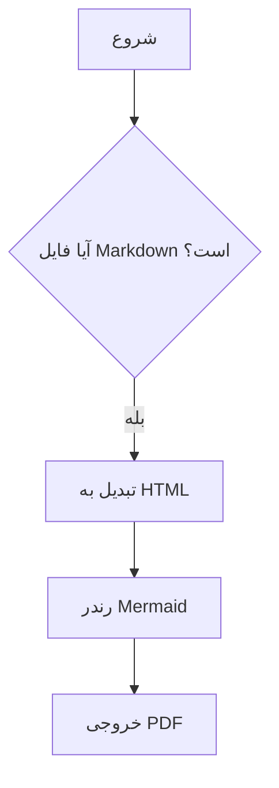

<div dir="rtl">

# fa-md-pdf

ابزار پایتونی برای تبدیل فایل‌های Markdown فارسی/راست‌به‌چپ به **PDF** یا **DOCX (Word)**، با پشتیبانی از نمودارهای Mermaid، رابط گرافیکی (GUI) و حالت کاملاً **آفلاین**.

نسخه فعلی **offline-first** است. اگر پروژه ساختار زیر را داشته باشد، دستور ساده زیر بدون نیاز به اینترنت کار می‌کند:

```powershell
fa-md-pdf .\docs
```

```text
fa-md-pdf-project/
  browsers/
    chromium-1217/
    chromium_headless_shell-1217/
    ffmpeg-1011/
    winldd-1007/
  fonts/
    Vazirmatn-Regular.ttf
    Vazirmatn-Bold.ttf
    ...
  vendor/
    mermaid.min.js
  docs/
```

## قابلیت‌ها

- تبدیل یک فایل Markdown به PDF یا DOCX
- تبدیل دسته‌ای همه فایل‌های یک فولدر
- پشتیبانی از `.md` و `.markdown`
- پشتیبانی از زیرپوشه‌ها به‌صورت پیش‌فرض
- پشتیبانی از فارسی و راست‌به‌چپ از طریق CSS و تنظیمات RTL در Word
- رندر نمودارهای Mermaid داخل PDF و DOCX (به‌صورت تصویر PNG)
- استفاده خودکار از `vendor/mermaid.min.js`
- استفاده خودکار از فونت‌های `fonts/Vazirmatn-*.ttf`
- استفاده خودکار از Chromium موجود در `browsers/`
- خروجی کنار فایل اصلی یا در فولدر خروجی جداگانه
- امکان تنظیم فونت، margin، اندازه صفحه، landscape و CSS سفارشی
- امکان نگه‌داشتن HTML میانی برای عیب‌یابی
- **رابط گرافیکی (GUI)** فارسی و راست‌به‌چپ با `tkinter`
- **حالت بسته‌بندی Markdown با `<div dir="rtl">`** برای اصلاح فایل‌های موجود (`--wrap-rtl`)
- خروجی exe مستقل برای ویندوز (CLI و GUI)

## نصب سریع در ویندوز

در PowerShell از داخل فولدر پروژه:

```powershell
py -m venv .venv
.\.venv\Scripts\Activate.ps1

python -m pip install --upgrade pip
pip install -e .
```

اگر از قبل Chromium مخصوص Playwright را دانلود کرده‌اید، کل محتویات مسیر زیر را داخل `browsers` پروژه کپی کنید:

```text
%LOCALAPPDATA%\ms-playwright
```

نمونه با دستور PowerShell:

```powershell
New-Item -ItemType Directory -Force .\browsers
Copy-Item "$env:LOCALAPPDATA\ms-playwright\*" ".\browsers\" -Recurse -Force
```

اگر Chromium را هنوز دانلود نکرده‌اید و اینترنت دارید:

```powershell
$env:PLAYWRIGHT_BROWSERS_PATH = "$PWD\browsers"
python -m playwright install chromium
```

بعد از این مرحله، اجرای تبدیل دیگر برای Chromium به اینترنت نیاز ندارد.

## آماده‌سازی Mermaid و فونت

فایل Mermaid را اینجا بگذارید:

```text
vendor\mermaid.min.js
```

فونت‌های فارسی را اینجا بگذارید:

```text
fonts\Vazirmatn-Regular.ttf
fonts\Vazirmatn-Bold.ttf
fonts\Vazirmatn-Medium.ttf
...
```

برنامه به‌صورت خودکار فایل‌های زیر را تشخیص می‌دهد:

```text
vendor\mermaid.min.js
fonts\Vazirmatn-*.ttf
browsers\
```

## رابط گرافیکی (GUI)

برای کاربرانی که خط فرمان را ترجیح نمی‌دهند، یک رابط گرافیکی فارسی/RTL با `tkinter` فراهم شده است:

```powershell
fa-md-pdf-gui
```

یا از طریق CLI:

```powershell
fa-md-pdf --gui
```

پنجره GUI شامل بخش‌های زیر است:
- انتخاب فایل/فولدر ورودی و فولدر خروجی
- انتخاب فرمت خروجی (PDF، DOCX، یا فقط بسته‌بندی RTL در Markdown)
- تب‌های تنظیمات: **صفحه** (فرمت/حاشیه/جهت)، **فونت**، **Mermaid** (فایل/تم/timeout)، **DOCX** (کیفیت تصویر، اندازه فونت)، **پیشرفته** (پسوندها، CSS سفارشی، مرورگرها)
- لاگ پیشرفت رنگی و دکمه انصراف

GUI همان موتور تبدیل CLI را استفاده می‌کند و مسیرهای آفلاین (`browsers/`، `vendor/mermaid.min.js`، `fonts/`) را خودکار شناسایی می‌کند.

## تبدیل یک فایل

```powershell
fa-md-pdf .\examples\sample-fa.md
```

خروجی کنار فایل اصلی ساخته می‌شود:

```text
examples\sample-fa.pdf
```

## تبدیل همه فایل‌های یک فولدر

```powershell
fa-md-pdf .\docs
```

به‌صورت پیش‌فرض، همه فایل‌های `.md` و `.markdown` داخل فولدر و زیرپوشه‌ها تبدیل می‌شوند.

## ذخیره خروجی‌ها در فولدر جدا

```powershell
fa-md-pdf .\docs -o .\pdf-output
```

اگر ورودی فولدر باشد، ساختار زیرپوشه‌ها در خروجی حفظ می‌شود.

## خروجی DOCX (Word)

برای تولید فایل Word به‌جای PDF از `-f docx` استفاده کنید:

```powershell
fa-md-pdf .\docs -f docx -o .\docx-output
```

ویژگی‌های خروجی DOCX:
- جهت RTL برای کل سند، شامل پاراگراف‌ها و عنوان‌ها
- نمودارهای Mermaid به‌صورت تصویر PNG با کیفیت بالا داخل سند جای می‌گیرند
- فونت پیش‌فرض از `--font-family` انتخاب می‌شود (تنها اولین خانواده مورد استفاده قرار می‌گیرد)

تنظیمات اختصاصی DOCX:

```powershell
fa-md-pdf .\docs -f docx `
  --docx-image-scale 3 `
  --docx-image-min-width 4.0 `
  --docx-image-max-width 6.5 `
  --docx-font-size 12
```

| گزینه | توضیح | پیش‌فرض |
|---|---|---|
| `--docx-image-scale` | ضریب کیفیت تصویر Mermaid (۱ تا ۴) | `3` |
| `--docx-image-min-width` | حداقل عرض تصویر (اینچ) | `4.0` |
| `--docx-image-max-width` | حداکثر عرض تصویر (اینچ) | `6.5` |
| `--docx-font-size` | اندازه فونت متن (پوینت) | `12` |

## تبدیل فقط فایل‌های مستقیم داخل فولدر

```powershell
fa-md-pdf .\docs --no-recursive
```

## مشاهده مسیرهای تشخیص داده‌شده

برای اطمینان از اینکه برنامه از مسیرهای آفلاین استفاده می‌کند:

```powershell
fa-md-pdf .\docs --verbose
```

خروجی باید شبیه این باشد:

```text
[fa-md-pdf] project root: E:\project\fa-md-pdf-project
[fa-md-pdf] format:       pdf
[fa-md-pdf] mermaid js:   E:\project\fa-md-pdf-project\vendor\mermaid.min.js
[fa-md-pdf] font dir:     E:\project\fa-md-pdf-project\fonts
[fa-md-pdf] browsers:     E:\project\fa-md-pdf-project\browsers
```

## گزینه‌های override

اگر خواستید مسیرها را دستی بدهید:

```powershell
fa-md-pdf .\docs `
  --browsers-path .\browsers `
  --mermaid-js .\vendor\mermaid.min.js `
  --font-dir .\fonts
```

اگر فقط یک فایل فونت دارید:

```powershell
fa-md-pdf .\docs --font-file .\fonts\Vazirmatn-Regular.ttf
```

اگر عمداً می‌خواهید Mermaid را از URL بگیرید:

```powershell
fa-md-pdf .\docs --mermaid-url "https://cdn.jsdelivr.net/npm/mermaid@11.15.0/dist/mermaid.min.js"
```

این گزینه برای اجرای کاملاً آفلاین توصیه نمی‌شود.

## گزینه‌های Mermaid

```powershell
fa-md-pdf .\docs --mermaid-theme neutral --mermaid-timeout 45000
```

| گزینه | توضیح | پیش‌فرض |
|---|---|---|
| `--mermaid-theme` | یکی از `default`, `base`, `dark`, `forest`, `neutral`, `null` | `default` |
| `--mermaid-timeout` | timeout رندر هر دیاگرام (میلی‌ثانیه) | `30000` |
| `--ignore-mermaid-errors` | ادامه تبدیل حتی در صورت خطای Mermaid | غیر فعال |

## گزینه‌های کاربردی

```powershell
fa-md-pdf .\docs --keep-html
```

HTML میانی را کنار PDF نگه می‌دارد.

```powershell
fa-md-pdf .\docs --page-format A4 --margin 14mm
```

اندازه صفحه و حاشیه را تنظیم می‌کند.

```powershell
fa-md-pdf .\docs --landscape
```

خروجی افقی می‌سازد.

```powershell
fa-md-pdf .\docs --fail-fast
```

در تبدیل دسته‌ای، با اولین خطا متوقف می‌شود.

## بسته‌بندی Markdown با `<div dir="rtl">`

برای اصلاح فایل‌های Markdown موجود (مثلاً برای نمایش درست در GitHub یا VSCode) و افزودن خودکار `<div dir="rtl">...</div>` به بلوک‌های فارسی:

```powershell
fa-md-pdf .\docs --wrap-rtl
```

ویژگی‌ها:
- بلوک‌های کد و wrapperهای موجود دست‌نخورده باقی می‌مانند
- ایدمپوتنت است (اجرای دوباره خروجی یکسان می‌دهد)
- در حالت پیش‌فرض، فایل کنار فایل اصلی با پسوند `.rtl` ذخیره می‌شود (`file.md → file.rtl.md`)

تغییر پسوند:

```powershell
fa-md-pdf .\docs --wrap-rtl --wrap-rtl-suffix ".out"
```

برای بازنویسی روی همان فایل:

```powershell
fa-md-pdf .\docs --wrap-rtl --wrap-rtl-suffix ""
```

نوشتن خروجی در فولدر جدا (ساختار زیرپوشه‌ها حفظ می‌شود):

```powershell
fa-md-pdf .\docs --wrap-rtl -o .\docs-rtl
```

## نمونه Mermaid

````markdown
# نمونه


````

## ساخت فایل exe مستقل

برای تولید نسخه‌های قابل توزیع `fa-md-pdf.exe` (CLI) و `fa-md-pdf-gui.exe` (GUI):

```powershell
.\scripts\build-exe.ps1
```

اسکریپت به‌طور خودکار `pyinstaller` را در صورت نیاز نصب می‌کند و دو فایل را تولید می‌کند:

```text
dist\fa-md-pdf.exe         # رابط خط فرمان
dist\fa-md-pdf-gui.exe     # رابط گرافیکی
```

### استفاده از exe

```powershell
.\dist\fa-md-pdf.exe .\docs              # تبدیل از CLI
.\dist\fa-md-pdf.exe --gui               # باز کردن GUI از CLI
.\dist\fa-md-pdf-gui.exe                 # باز کردن مستقیم GUI
```

برای اجرای آفلاین، فولدرهای `browsers/`، `fonts/` و `vendor/` را کنار فایل exe قرار دهید.

## رابط کاربری مدرن دسکتاپ (Tauri 2 + React)

علاوه بر رابط گرافیکی کلاسیک Tkinter، نسخه مدرن میزکار بر پایه **Tauri 2**، **React 19**، **TypeScript**، **Tailwind CSS v4** و **Vazirmatn** در پوشه `desktop-tauri/` توسعه داده شده است:
- **میزکار ۳ بخشی:** صف فایل‌ها با Drag & Drop، پنل تنظیمات ۵ تب با تطابق ۱۰۰٪ تمام ۳۲ پارامتر، و پیش‌نمایش سند / کنسول استریم بلادرنگ.
- **تم تیره و روشن استاندارد:** طراحی شیک، مینیمال و بهینه‌سازی‌شده برای دسکتاپ.
- **تست خودکار:** تست‌های یکپارچگی ترجمه آرگومان‌های خط فرمان.

### اجرای نسخه توسعه:
```powershell
cd desktop-tauri
npm install
npm run dev
```

### بیلد نهایی و تست واحد:
```powershell
cd desktop-tauri
npm test
npm run build
```

## ساختار پروژه

```text
fa-md-pdf-project/
  browsers/                       # Chromium مخصوص Playwright، برای اجرای آفلاین
  fonts/                          # فونت‌های فارسی
  vendor/mermaid.min.js           # Mermaid آفلاین
  src/fa_md_pdf/
    cli.py                        # رابط خط فرمان
    gui.py                        # رابط گرافیکی tkinter
    converter.py                  # موتور تبدیل (PDF و DOCX)
    docx_builder.py               # تولید سند Word با RTL
    mermaid_renderer.py           # رندر Mermaid به PNG برای DOCX
    html_builder.py               # تبدیل Markdown به HTML
    rtl_wrapper.py                # بسته‌بندی Persian با <div dir="rtl">
    defaults.py                   # تشخیص project root و دارایی‌های آفلاین
    assets/default.css            # CSS پایه RTL
  examples/
    sample-fa.md
  docs/
    USAGE.md
    ARCHITECTURE.md
    CHANGELOG.md
    GUI-PROPOSAL.md
  scripts/
    setup-windows.ps1
    build-exe.ps1                 # ساخت فایل‌های exe با PyInstaller
  tests/
  fa-md-pdf.spec                  # PyInstaller spec برای CLI
  fa-md-pdf-gui.spec              # PyInstaller spec برای GUI
  entry_point.py                  # نقطه ورود exe برای CLI
  entry_point_gui.py              # نقطه ورود exe برای GUI
  pyproject.toml
  requirements.txt
  README.md
```

## عیب‌یابی

### خطای `No module named playwright`

محیط مجازی را فعال کنید و پروژه را نصب کنید:

```powershell
.\.venv\Scripts\Activate.ps1
pip install -e .
```

### خطای پیدا نشدن مرورگر Playwright

مطمئن شوید این فولدر وجود دارد:

```text
browsers\chromium-...
```

و با `--verbose` بررسی کنید که برنامه همین فولدر را می‌بیند.

### Mermaid نمایش داده نمی‌شود

مطمئن شوید این فایل وجود دارد:

```text
vendor\mermaid.min.js
```

### فونت فارسی در PDF خوب نیست

مطمئن شوید فونت‌ها داخل فولدر `fonts` هستند. برنامه فایل‌های `Vazirmatn-*.ttf` را خودکار داخل CSS embed می‌کند.

### فونت فارسی در DOCX درست نمایش داده نمی‌شود

DOCX نام فونت سیستمی را استفاده می‌کند، نه فایل embed شده. اطمینان حاصل کنید فونت Vazirmatn (یا فونت انتخابی شما) روی سیستم بازکننده فایل نصب باشد، یا با `--font-family` فونت موجود روی سیستم را انتخاب کنید:

```powershell
fa-md-pdf .\docs -f docx --font-family "Tahoma"
```

### عکس‌های نسبی داخل Markdown پیدا نمی‌شوند

مسیر عکس‌ها را نسبت به همان فایل Markdown بنویسید. برنامه برای هر فایل، مسیر پایه HTML را فولدر همان فایل قرار می‌دهد.

## توسعه

نصب وابستگی‌های توسعه:

```powershell
pip install -e ".[dev]"
pytest
```

## مجوز

MIT

</div>
