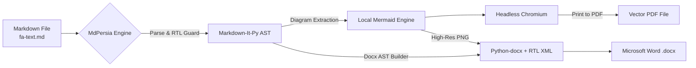

<p align="center">
  <h1 align="center">MdPersia</h1>
  <p align="center">
    <strong>The Modern, Offline-First Persian & RTL Markdown to Word (DOCX) and PDF Converter</strong><br />
    Native Mermaid Diagrams &bull; Flawless BiDi Formatting &bull; High-Fidelity Word Styling &bull; CLI &amp; GUI
  </p>
</p>

<p align="center">
  <a href="https://github.com/hamid-morsali-786/MdPersia/actions/workflows/ci.yml">
    
  </a>
  <a href="https://pypi.org/project/mdpersia/">
    
  </a>
  <a href="https://www.python.org/">
    
  </a>
  <a href="LICENSE">
    
  </a>
  <a href="https://github.com/astral-sh/ruff">
    
  </a>
  <a href="README_FA.md">
    
  </a>
</p>

<p align="center">
  <a href="#why-mdpersia">Why MdPersia</a> &bull;
  <a href="#features">Key Features</a> &bull;
  <a href="#comparison">Comparison Matrix</a> &bull;
  <a href="#quickstart">Quickstart</a> &bull;
  <a href="#cli-usage">CLI Usage</a> &bull;
  <a href="#python-api">Python API</a> &bull;
  <a href="#architecture">Architecture</a> &bull;
  <a href="#contributing">Contributing</a>
</p>

---

## Why MdPersia?

Converting technical Markdown files containing **Persian / Arabic (RTL)** text into publishable documents has historically been frustrating:

- ❌ **Flipped Punctuation & Mixed Text**: English terms, version numbers, brackets `()` and code blocks within Persian text frequently flip direction in traditional PDF generators.
- ❌ **Broken Word (DOCX) Tables & Layouts**: Generic converters produce left-to-right Word files where text clings to the wrong side and tables lose alignment.
- ❌ **Failed Mermaid Rendering**: System architecture diagrams, flowcharts, and sequence diagrams rarely render without external internet connections or complex LaTeX toolchains.

**MdPersia** solves this definitively. It provides a rock-solid, offline-first pipeline that renders Markdown files with accurate BiDi text direction, beautiful Persian typography (Vazirmatn), crystal-clear Mermaid diagrams, and exports them directly to both **vector PDF** and **native Microsoft Word (DOCX)**.

---

## Features

- 📑 **Dual Native Outputs**: Generate publication-grade **PDFs** via headless Chromium, or fully editable, RTL-configured **Word (.docx)** files.
- 📐 **First-Class Mermaid Support**: Flowcharts, Sequence Diagrams, Gantt charts, and Class diagrams are automatically rendered and embedded.
- 🔒 **100% Offline-First**: Zero runtime calls to external CDNs. Bundles local Chromium support, embedded Vazirmatn fonts, and local Mermaid JavaScript.
- 🔄 **Real-Time Watch Mode (`-w` / `--watch`)**: Automatically re-compiles documents on file save.
- 📦 **Batch Directory Conversion**: Converts entire documentation folders while preserving hierarchical directory structures.
- 🪄 **Intelligent Markdown Repair (`--wrap-rtl`)**: Automatically wraps Persian paragraphs with `<div dir="rtl">` without touching code blocks or existing markup.
- 🖥️ **Both CLI and Modern GUI**: Seamless command-line interface for CI/CD and scripts, plus a clean graphical interface (Tkinter and Tauri).

---

## Comparison Matrix

| Feature | MdPersia | Pandoc + XeLaTeX | VS Code Markdown-PDF | Typora Export |
| :--- | :---: | :---: | :---: | :---: |
| **Persian / RTL Accuracy** | **Flawless (Native)** | Complex Config | Inconsistent | Good |
| **Native Word (.docx) RTL** | **Yes (Full RTL)** | Basic / LTR Defaults | No | Basic |
| **Offline Mermaid Diagrams** | **Built-in** | Requires Filters | Requires Internet | Partial |
| **Zero External Setup** | **Yes (Standalone)** | Requires >4GB TeXLive | Requires Extension | Closed Source |
| **Batch Folder Processing** | **Yes** | Manual Scripting | Manual | No |
| **Live Watch Daemon** | **Yes (`-w`)** | No | No | No |
| **Graphical User Interface** | **Yes (GUI included)** | No | Editor GUI | Editor GUI |

---

## Installation

### Via pip

```bash
pip install mdpersia
```

### From Source (Development)

```bash
git clone https://github.com/hamid-morsali-786/MdPersia.git
cd MdPersia

# Create and activate virtual environment
python -m venv .venv
source .venv/bin/activate  # On Windows: .\.venv\Scripts\Activate.ps1

# Install in editable mode with dev dependencies
pip install -e ".[dev]"
```

### Headless Browser Setup (One-time)

If you have an internet connection during setup:
```bash
python -m playwright install chromium
```

> **Offline Portable Mode:** Place your Chromium binaries in `./browsers/`, fonts in `./fonts/`, and `mermaid.min.js` in `./vendor/`. MdPersia will automatically detect them without needing any system installations!

---

## Quickstart

### 1. Convert a single file to PDF
```bash
mdpersia ./docs/sample.md
```
*Creates `./docs/sample.pdf`.*

### 2. Convert to Microsoft Word (DOCX)
```bash
mdpersia ./docs/sample.md -f docx
```
*Creates `./docs/sample.docx` with right-to-left layout and styled tables.*

### 3. Convert an entire folder with custom output directory
```bash
mdpersia ./docs -o ./dist -f pdf
```

### 4. Watch for changes in real time
```bash
mdpersia ./docs/specification.md -w -f pdf
```

### 5. Launch the Graphical User Interface
```bash
mdpersia --gui
```

---

## Architecture



---

## Python API

You can easily integrate MdPersia into your own Python applications or automation pipelines:

```python
from pathlib import Path
from mdpersia import build_jobs, convert_jobs, ConvertOptions

options = ConvertOptions(
    format="docx",       # "pdf" or "docx"
    font_family='"Vazirmatn", sans-serif',
    page_format="A4",
    margin="15mm"
)

jobs = build_jobs(
    input_path=Path("./docs/architecture.md"),
    options=options
)

success, failed = convert_jobs(jobs)
print(f"Completed: {success} succeeded, {failed} failed.")
```

---

## CLI Options Reference

```text
usage: mdpersia [-h] [-o OUTPUT] [-f {pdf,docx}]
                [--docx-image-scale {1,2,3,4}]
                [--docx-image-min-width DOCX_IMAGE_MIN_WIDTH]
                [--docx-image-max-width DOCX_IMAGE_MAX_WIDTH]
                [--docx-font-size DOCX_FONT_SIZE] [--recursive]
                [--no-recursive] [--extensions EXTENSIONS [EXTENSIONS ...]]
                [--font-family FONT_FAMILY] [--font-file FONT_FILE]
                [--font-dir FONT_DIR] [--css CSS] [--page-format PAGE_FORMAT]
                [--margin MARGIN] [--landscape] [--strip-emojis]
                [--mermaid-js MERMAID_JS] [--mermaid-url MERMAID_URL]
                [--mermaid-theme {default,base,dark,forest,neutral,null}]
                [--mermaid-timeout MERMAID_TIMEOUT] [--ignore-mermaid-errors]
                [--browsers-path BROWSERS_PATH] [--keep-html] [--fail-fast]
                [--verbose] [--version] [--gui] [--wrap-rtl]
                [--wrap-rtl-suffix WRAP_RTL_SUFFIX] [-w]
                [input]
```

| Flag | Description | Default |
| :--- | :--- | :--- |
| `input` | File or folder containing Markdown files | Current directory |
| `-o, --output` | Output file path or destination folder | Next to source file |
| `-f, --format` | Output format: `pdf` or `docx` | `pdf` |
| `-w, --watch` | Watch file/folder for live auto-conversion | `False` |
| `--gui` | Launch graphical desktop window | `False` |
| `--docx-image-scale` | Diagram resolution multiplier for Word (1-4) | `3` |
| `--page-format` | PDF page size (`A4`, `Letter`, `Legal`) | `A4` |
| `--margin` | Page margin (e.g., `15mm`, `1in`, `20px`) | `15mm` |
| `--landscape` | Produce landscape orientation documents | Portrait |
| `--strip-emojis` | Strip emojis from converted documents | `False` |
| `--wrap-rtl` | Automatically inject `<div dir="rtl">` tags | `False` |

---

## Contributing

We welcome contributions from the community!  
Please see our [Contributing Guide](CONTRIBUTING.md) and [Code of Conduct](CODE_OF_CONDUCT.md) for details on submitting pull requests, reporting issues, or suggesting design improvements.

---

## Security

Please review our [Security Policy](SECURITY.md) to report vulnerabilities responsibly.

---

## Author & License

Created and maintained with ❤️ by **[Hamid Morsali](https://github.com/hamid-morsali-786)**.

Licensed under the **[MIT License](LICENSE)**.
