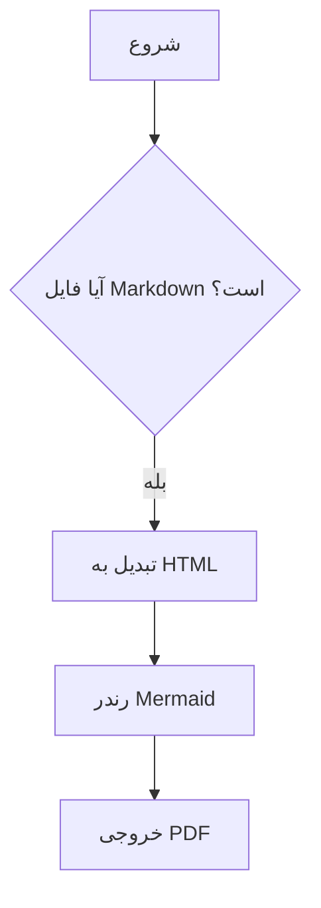

<dev dir="rtl">

# fa-md-pdf

یک ابزار خط فرمان پایتونی برای تبدیل فایل‌های Markdown فارسی/راست‌به‌چپ به PDF، با پشتیبانی از نمودارهای Mermaid.

نسخه فعلی **offline-first** است. اگر پروژه این ساختار را داشته باشد، دستور ساده زیر بدون نیاز به اینترنت کار می‌کند:

```powershell
fa-md-pdf .\docs
```

```text
fa-md-pdf-project/
  browsers/
    chromium-1217/
    chromium_headless_shell-1217/
    ffmpeg-1011/
    winldd-1007/
  fonts/
    Vazirmatn-Regular.ttf
    Vazirmatn-Bold.ttf
    ...
  vendor/
    mermaid.min.js
  docs/
```

## قابلیت‌ها

- تبدیل یک فایل Markdown به PDF با همان نام
- تبدیل دسته‌ای همه فایل‌های Markdown داخل یک فولدر
- پشتیبانی از `.md` و `.markdown`
- پشتیبانی از زیرپوشه‌ها به‌صورت پیش‌فرض
- پشتیبانی از فارسی و راست‌به‌چپ از طریق CSS
- رندر نمودارهای Mermaid داخل PDF
- استفاده خودکار از `vendor/mermaid.min.js`
- استفاده خودکار از فونت‌های `fonts/Vazirmatn-*.ttf`
- استفاده خودکار از Chromium موجود در `browsers/`
- خروجی کنار فایل اصلی یا در فولدر خروجی جداگانه
- امکان تنظیم فونت، margin، اندازه صفحه، landscape و CSS سفارشی
- امکان نگه‌داشتن HTML میانی برای عیب‌یابی

## نصب سریع در ویندوز

در PowerShell از داخل فولدر پروژه:

```powershell
py -m venv .venv
.\.venv\Scripts\Activate.ps1

python -m pip install --upgrade pip
pip install -e .
```

اگر از قبل Chromium مخصوص Playwright را دانلود کرده‌اید، کل محتویات مسیر زیر را داخل `browsers` پروژه کپی کنید:

```text
%LOCALAPPDATA%\ms-playwright
```

نمونه:

```powershell
.\scripts\copy-existing-playwright-browsers.ps1
```

یا دستی:

```powershell
New-Item -ItemType Directory -Force .\browsers
Copy-Item "$env:LOCALAPPDATA\ms-playwright\*" ".\browsers\" -Recurse -Force
```

اگر Chromium را هنوز دانلود نکرده‌اید و اینترنت دارید:

```powershell
$env:PLAYWRIGHT_BROWSERS_PATH = "$PWD\browsers"
python -m playwright install chromium
```

بعد از این مرحله، اجرای تبدیل دیگر برای Chromium به اینترنت نیاز ندارد.

## آماده‌سازی Mermaid و فونت

فایل Mermaid را اینجا بگذارید:

```text
vendor\mermaid.min.js
```

فونت‌های فارسی را اینجا بگذارید:

```text
fonts\Vazirmatn-Regular.ttf
fonts\Vazirmatn-Bold.ttf
fonts\Vazirmatn-Medium.ttf
...
```

برنامه به‌صورت خودکار فایل‌های زیر را تشخیص می‌دهد:

```text
vendor\mermaid.min.js
fonts\Vazirmatn-*.ttf
browsers\
```

## تبدیل یک فایل

```powershell
fa-md-pdf .\examples\sample-fa.md
```

خروجی کنار فایل اصلی ساخته می‌شود:

```text
examples\sample-fa.pdf
```

## تبدیل همه فایل‌های یک فولدر

```powershell
fa-md-pdf .\docs
```

به‌صورت پیش‌فرض، همه فایل‌های `.md` و `.markdown` داخل فولدر و زیرپوشه‌ها تبدیل می‌شوند.

## ذخیره خروجی‌ها در فولدر جدا

```powershell
fa-md-pdf .\docs -o .\pdf-output
```

اگر ورودی فولدر باشد، ساختار زیرپوشه‌ها در خروجی حفظ می‌شود.

## تبدیل فقط فایل‌های مستقیم داخل فولدر

```powershell
fa-md-pdf .\docs --no-recursive
```

## مشاهده مسیرهای تشخیص داده‌شده

برای اطمینان از اینکه برنامه از مسیرهای آفلاین استفاده می‌کند:

```powershell
fa-md-pdf .\docs --verbose
```

خروجی باید شبیه این باشد:

```text
[fa-md-pdf] project root: E:\project\fa-md-pdf-project
[fa-md-pdf] mermaid js:   E:\project\fa-md-pdf-project\vendor\mermaid.min.js
[fa-md-pdf] font dir:     E:\project\fa-md-pdf-project\fonts
[fa-md-pdf] browsers:     E:\project\fa-md-pdf-project\browsers
```

## گزینه‌های override

اگر خواستید مسیرها را دستی بدهید:

```powershell
fa-md-pdf .\docs `
  --browsers-path .\browsers `
  --mermaid-js .\vendor\mermaid.min.js `
  --font-dir .\fonts
```

اگر فقط یک فایل فونت دارید:

```powershell
fa-md-pdf .\docs --font-file .\fonts\Vazirmatn-Regular.ttf
```

اگر عمداً می‌خواهید Mermaid را از URL بگیرید:

```powershell
fa-md-pdf .\docs --mermaid-url "https://cdn.jsdelivr.net/npm/mermaid@11.15.0/dist/mermaid.min.js"
```

این گزینه برای اجرای کاملاً آفلاین توصیه نمی‌شود.

## گزینه‌های کاربردی

```powershell
fa-md-pdf .\docs --keep-html
```

HTML میانی را کنار PDF نگه می‌دارد.

```powershell
fa-md-pdf .\docs --page-format A4 --margin 14mm
```

اندازه صفحه و حاشیه را تنظیم می‌کند.

```powershell
fa-md-pdf .\docs --landscape
```

خروجی افقی می‌سازد.

```powershell
fa-md-pdf .\docs --fail-fast
```

در تبدیل دسته‌ای، با اولین خطا متوقف می‌شود.

```powershell
fa-md-pdf .\docs --ignore-mermaid-errors
```

اگر Mermaid خطا بدهد، تبدیل ادامه پیدا می‌کند و هشدار چاپ می‌شود.

## نمونه Mermaid

````markdown
# نمونه


````

## ساختار پروژه

```text
fa-md-pdf-project/
  browsers/                 # Chromium مخصوص Playwright، برای اجرای آفلاین
  fonts/                    # فونت‌های فارسی
  vendor/mermaid.min.js     # Mermaid آفلاین
  src/fa_md_pdf/
    cli.py
    converter.py
    defaults.py
    html_builder.py
    assets/default.css
  examples/
    sample-fa.md
  docs/
    USAGE.md
    ARCHITECTURE.md
    OFFLINE.md
  scripts/
    setup-windows.ps1
  tests/
  pyproject.toml
  requirements.txt
  README.md
```

## عیب‌یابی

### خطای `No module named playwright`

محیط مجازی را فعال کنید و پروژه را نصب کنید:

```powershell
.\.venv\Scripts\Activate.ps1
pip install -e .
```

### خطای پیدا نشدن مرورگر Playwright

مطمئن شوید این فولدر وجود دارد:

```text
browsers\chromium-...
```

و با `--verbose` بررسی کنید که برنامه همین فولدر را می‌بیند.

### Mermaid نمایش داده نمی‌شود

مطمئن شوید این فایل وجود دارد:

```text
vendor\mermaid.min.js
```

### فونت فارسی در PDF خوب نیست

مطمئن شوید فونت‌ها داخل فولدر `fonts` هستند. برنامه فایل‌های `Vazirmatn-*.ttf` را خودکار داخل CSS embed می‌کند.

### عکس‌های نسبی داخل Markdown پیدا نمی‌شوند

مسیر عکس‌ها را نسبت به همان فایل Markdown بنویسید. برنامه برای هر فایل، مسیر پایه HTML را فولدر همان فایل قرار می‌دهد.

## توسعه

نصب وابستگی‌های توسعه:

```powershell
pip install -e ".[dev]"
pytest
```

## مجوز

MIT
