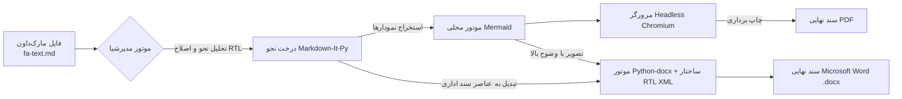

<div align="center">

# مدپرشیا (MdPersia)
### ابزار مدرن، آفلاین و تخصصی تبدیل اسناد Markdown فارسی و RTL به Word (DOCX) و PDF

[](https://github.com/hamid-morsali-786/MdPersia/stargazers)
[](https://github.com/hamid-morsali-786/MdPersia/network/members)
[](LICENSE)
[](https://python.org)
[](https://github.com/hamid-morsali-786/MdPersia/actions)
[](CONTRIBUTING.md)

<p align="center">
  <b>توسعه و نگهداری توسط:</b> <a href="https://github.com/hamid-morsali-786">hamid-morsali-786</a>
</p>

**فارسی** | [English](README.en.md)

<br/>

<p align="center">
  
</p>

</div>

---

<div dir="rtl">

## 📑 فهرست مطالب (Table of Contents)

- [معرفی و چرا MdPersia؟](#-معرفی-و-چرا-mdpersia)
- [ویژگی‌های کلیدی](#-ویژگیهای-کلیدی-key-features)
- [جدول مقایسه قابلیت‌ها](#-جدول-مقایسه-قابلیتها)
- [نصب و راه‌اندازی](#-نصب-و-راهاندازی-installation)
- [شروع سریع (Quick Start)](#-شروع-سریع-quick-start)
- [رابط کاربری گرافیکی (Desktop GUI)](#-رابط-کاربری-گرافیکی-desktop-gui)
- [جدول راهنمای گزینه‌های CLI](#-جدول-راهنمای-گزینههای-cli)
- [استفاده از کتابخانه در پایتون (Python API)](#-استفاده-از-کتابخانه-در-پایتون-python-api)
- [معماری سیستم (Architecture)](#-معماری-سیستم-architecture)
- [تاریخچه ستاره‌ها (Star History)](#-تاریخچه-ستارهها-star-history)
- [مشارکت و حق امتیاز](#-مشارکت-و-حق-امتیاز)

---

## 🎯 معرفی و چرا MdPersia؟

توسعه‌دهندگان، پژوهشگران و تولیدکنندگان محتوا هنگام تبدیل فایل‌های Markdown حاوی متون **فارسی و راست‌به‌چپ (RTL)** به اسناد قابل چاپ و ارائه، همواره با چالش‌های فنی متعددی روبه‌رو بوده‌اند:

- ❌ **به‌هم‌ریختگی علائم و متون ترکیبی:** کلمات انگلیسی، پرانتزها `()`، اعداد و کدهای درون‌خطی در خروجی ابزارهای رایج برعکس یا جابه‌جا می‌شوند.
- ❌ **فقدان ساختار راست‌چین در Word (DOCX):** تبدیل‌کننده‌های رایج، جهت سند Word و جداول را چپ‌به‌راست می‌سازند و پاراگراف‌ها از چپ تراز می‌شوند.
- ❌ **عدم رندر صحیح نمودارهای Mermaid:** فلوچارت‌ها و دیاگرام‌های فنی درون Markdown بدون اینترنت یا ابزارهای پیچیده رندر نمی‌شوند.

**مدپرشیا (MdPersia)** برای حل کامل این مشکلات طراحی شده است؛ این ابزار با معماری دوگانه و مدرن خود، متون مارک‌داون شما را با جهت‌بندی بی‌نقص BiDi، فونت استاندارد وزیرمتن و رندر دقیق دیاگرام‌های Mermaid مستقیماً به دو فرمت رسمی **PDF برداری** و **Microsoft Word (DOCX)** تبدیل می‌کند.

---

## 🚀 ویژگی‌های کلیدی (Key Features)

| قابلیت | شرح فنی | مزیت |
|---|---|---|
| 📄 **خروجی هم‌زمان Word و PDF** | تولید فایل `.docx` کاملاً راست‌چین و فایل `.pdf` برداری با کیفیت چاپ | مناسب برای گزارش‌های رسمی سازمانی و مقالات |
| 📊 **پشتیبانی کامل از Mermaid** | تبدیل خودکار انواع Flowchart، Sequence، Class و Gantt | قرارگیری تصاویر نمودارها با کیفیت رتینا درون سند |
| ⚡ **کاملاً آفلاین (Offline-First)** | بدون وابستگی به CDNهای آنلاین و اینترنت | مرورگر، فونت‌های وزیرمتن و رندرر همگی به صورت محلی مدیریت می‌شوند |
| 🔄 **پایش زنده (`-w` / `--watch`)** | کامپایل مجدد و بلادرنگ اسناد با هر ذخیره‌سازی (`Ctrl+S`) | تجربه کاری روان و آنی بدون نیاز به اجرای مکرر دستور |
| 📁 **تبدیل دسته‌ای پوشه‌ها** | پردازش هم‌زمان کل پوشه‌ها با حفظ دقیق ساختار درختی | تبدیل خودکار کل مستندات پروژه در چند ثانیه |
| 🪄 **اصلاح هوشمند (`--wrap-rtl`)** | تزریق خودکار `<div dir="rtl">` بدون آسیب به بلوک‌های کد | اصلاح و آماده‌سازی سریع یادداشت‌های قدیمی |
| 🖥️ **رابط گرافیکی مدرن (GUI)** | اپلیکیشن دسکتاپ بر پایه Tauri با تم روشن/تاریک و کنسول زنده | استفاده آسان برای تمام کاربران حتی بدون استفاده از ترمینال |

---

## 📊 جدول مقایسه قابلیت‌ها

| ویژگی | MdPersia | Pandoc + XeLaTeX | VS Code Markdown-PDF | Typora Export |
| :--- | :---: | :---: | :---: | :---: |
| **دقت حروف‌چینی فارسی و RTL** | **بی‌نقص و پیش‌فرض** | نیازمند تنظیمات پیچیده | ناپایدار در متون ترکیبی | خوب |
| **خروجی Word (DOCX) راست‌چین** | **بله (کامل و بومی)** | پایه و چپ‌چین | خیر | متوسط |
| **رندر آفلاین دیاگرام‌های Mermaid** | **داخلی و خودکار** | نیازمند فیلترهای جانبی | نیازمند اینترنت | وابسته به موتور نرم‌افزار |
| **حجم و پیش‌نیاز راه‌اندازی** | **سبک و بدون پیش‌نیاز سنگین** | نیازمند TeXLive با حجم چند گیگابایت | وابسته به افزونه ادیتور | بسته و غیرمتن‌باز |
| **پردازش دسته‌ای پوشه‌ها** | **بله** | نیازمند اسکریپت‌نویسی | دستی | خیر |
| **پایش زنده (Watch Daemon)** | **بله (`-w`)** | خیر | خیر | خیر |
| **رابط کاربری دسکتاپ (GUI)** | **بله (همراه پروژه)** | خیر | رابط ادیتور | رابط ادیتور |

---

## 💻 نصب و راه‌اندازی (Installation)

### نصب از طریق pip
```bash
pip install mdpersia
```

### نصب سورس پروژه (برای توسعه‌دهندگان)
```powershell
git clone https://github.com/hamid-morsali-786/MdPersia.git
cd MdPersia

# ساخت و فعال‌سازی محیط مجازی
py -m venv .venv
.\.venv\Scripts\Activate.ps1

# نصب پکیج و وابستگی‌ها در حالت توسعه
pip install -e ".[dev]"
```

### آماده‌سازی موتور مرورگر (یک‌بار برای همیشه)
اگر به اینترنت متصل هستید:
```powershell
python -m playwright install chromium
```

> **حالت پرتابل و کاملاً آفلاین:** اگر فایل‌های Chromium را در پوشه `browsers/`، فونت‌ها را در `fonts/` و فایل `mermaid.min.js` را در پوشه `vendor/` قرار دهید، برنامه بدون نیاز به هیچ اتصال اینترنتی کار خواهد کرد.

---

## ⚡ شروع سریع (Quick Start)

### ۱. تبدیل یک فایل به PDF (پیش‌فرض)
```powershell
mdpersia .\docs\sample.md
```
*خروجی `docs\sample.pdf` با فونت زیبای وزیرمتن ساخته می‌شود.*

### ۲. تبدیل به فایل Word (DOCX)
```powershell
mdpersia .\docs\sample.md -f docx
```
*خروجی `docs\sample.docx` با جدول‌ها و پاراگراف‌های کاملاً راست‌چین ایجاد می‌گردد.*

### ۳. تبدیل دسته‌ای تمام فایل‌های یک پوشه به همراه مقصد دلخواه
```powershell
mdpersia .\docs -o .\output -f pdf
```

### ۴. فعال‌سازی حالت پایش زنده (Live Watch Mode)
```powershell
mdpersia .\docs\report.md -w -f docx
```

### ۵. اجرای رابط گرافیکی
```powershell
mdpersia --gui
```
*یا اجرای فایل `run_gui.bat` با دابل‌کلیک در ویندوز.*

---

## 🖥️ رابط کاربری گرافیکی (Desktop GUI)

نرم‌افزار دسکتاپ **مدپرشیا** امکانات کاملی برای مدیریت پروژه‌های مستندسازی فراهم می‌کند:
- **صف فایل‌ها:** امکان افزودن فایل‌ها یا پوشه‌ها و مشاهده وضعیت هر فایل.
- **پنل تنظیمات سند:** انتخاب قطع کاغذ (A4، Letter، A3)، تنظیم حاشیه‌ها، انتخاب تم دیاگرام‌های Mermaid و تعیین اندازه فونت Word.
- **کنسول و لاگ‌های زنده:** نمایش بلادرنگ مراحل تبدیل با امکان توقف آنی.
- **تغییر تم:** پشتیبانی کامل از تم روشن و تاریک.

<p align="center">
  
</p>

---

## ⚙️ جدول راهنمای گزینه‌های CLI

| سوئیچ | توضیحات | مقدار پیش‌فرض |
| :--- | :--- | :--- |
| `input` | مسیر فایل یا پوشه شامل فایل‌های Markdown | پوشه جاری |
| `-o, --output` | مسیر ذخیره فایل یا پوشه خروجی | کنار فایل اصلی |
| `-f, --format` | فرمت خروجی (`pdf` یا `docx`) | `pdf` |
| `-w, --watch` | پایش تغییرات فایل و تبدیل آنی پس از ذخیره | غیرفعال |
| `--gui` | باز کردن رابط گرافیکی دسکتاپ | غیرفعال |
| `--docx-image-scale` | ضریب کیفیت تصاویر Mermaid در فایل Word (۱ تا ۴) | `3` |
| `--docx-font-size` | اندازه قلم متن اصلی در Word (به پوینت) | `12` |
| `--page-format` | ابعاد برگه در PDF (`A4`, `Letter`, `Legal`) | `A4` |
| `--margin` | اندازه حاشیه صفحات در PDF (مانند `15mm` یا `1in`) | `15mm` |
| `--landscape` | تولید صفحات افقی | عمودی |
| `--strip-emojis` | حذف اموجی‌ها از خروجی نهایی سند | غیرفعال |
| `--wrap-rtl` | تزریق خودکار تگ‌های `<div dir="rtl">` به متن | غیرفعال |

---

## 🐍 استفاده از کتابخانه در پایتون (Python API)

می‌توانید از قابلیت‌های **MdPersia** درون کدهای پایتون خود نیز استفاده کنید:

```python
from pathlib import Path
from mdpersia import build_jobs, convert_jobs, ConvertOptions

options = ConvertOptions(
    format="docx",       # یا "pdf"
    font_family='"Vazirmatn", sans-serif',
    page_format="A4",
    margin="15mm"
)

jobs = build_jobs(
    input_path=Path("./docs/architecture.md"),
    options=options
)

success, failed = convert_jobs(jobs)
print(f"نتیجه تبدیل: {success} موفق، {failed} ناموفق")
```

---

## 🏗️ معماری سیستم (Architecture)



---

## ⭐ تاریخچه ستاره‌ها (Star History)

[](https://star-history.com/#hamid-morsali-786/MdPersia&Date)

---

## 🤝 مشارکت و حق امتیاز

از همه مشارکت‌ها، پیشنهادات و گزارش‌های اشکال استقبال می‌کنیم! لطفاً قبل از شروع، [راهنمای مشارکت (CONTRIBUTING.md)](CONTRIBUTING.md) و [منشور اخلاقی (CODE_OF_CONDUCT.md)](CODE_OF_CONDUCT.md) را مطالعه فرمایید.

### توسعه‌دهنده
توسعه‌داده شده با ❤️ توسط **[حمید مرسلی (Hamid Morsali)](https://github.com/hamid-morsali-786)**.

### لایسنس
این پروژه تحت مجوز متن‌باز **[MIT License](LICENSE)** منتشر شده است.

</div>
