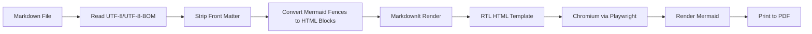

# معماری پروژه

## هدف

تبدیل مستندات Markdown فارسی/راست‌به‌چپ، شامل نمودارهای Mermaid، به PDF با یک ابزار CLI قابل استفاده در ویندوز و CI.

## جریان تبدیل

## اجزای اصلی

| فایل | مسئولیت |
|---|---|
| `cli.py` | پارس کردن آرگومان‌های خط فرمان، ساخت تنظیمات و اجرای تبدیل |
| `converter.py` | کشف فایل‌ها، ساخت jobها، اجرای Playwright و تولید PDF |
| `html_builder.py` | تبدیل Markdown به HTML راست‌به‌چپ و تزریق CSS/Mermaid |
| `assets/default.css` | استایل پایه برای فارسی، RTL، جدول‌ها، code blockها و چاپ |

## تصمیم‌های طراحی

### چرا HTML → PDF؟

برای فارسی و Mermaid، مسیر HTML به PDF در عمل ساده‌تر و قابل کنترل‌تر از LaTeX است. Chromium از CSS، فونت‌های سیستم، SVG و جهت راست‌به‌چپ پشتیبانی خوبی دارد.

### چرا Playwright؟

Playwright کنترل مستقیم Chromium را فراهم می‌کند و می‌تواند صفحه HTML را با CSS print به PDF تبدیل کند.

### چرا Mermaid داخل مرورگر رندر می‌شود؟

این روش نیاز به نصب Node.js یا Mermaid CLI ندارد. فایل Markdown به HTML تبدیل می‌شود، سپس Mermaid.js در همان صفحه نمودارها را به SVG تبدیل می‌کند.

## محدودیت‌ها

- اگر از CDN Mermaid استفاده شود، برای تبدیل به اینترنت نیاز است.
- برای حالت کاملاً آفلاین باید فایل `mermaid.min.js` محلی داده شود.
- کیفیت PDF به فونت‌های نصب‌شده روی سیستم بستگی دارد.
- برخی قابلیت‌های بسیار خاص Markdown ممکن است نیاز به plugin جداگانه داشته باشند.
