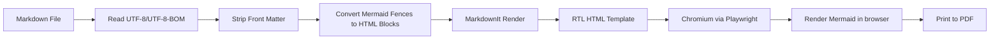
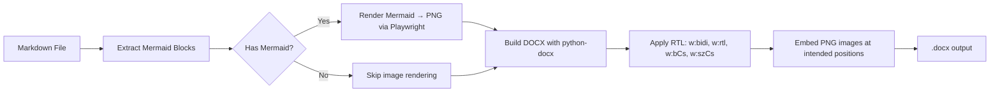
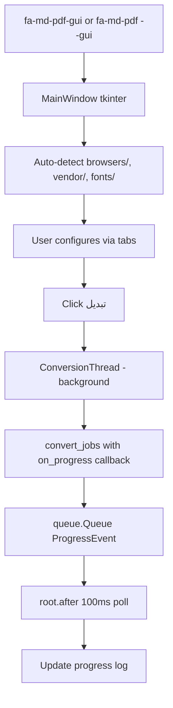

# معماری پروژه

## هدف

تبدیل مستندات Markdown فارسی/راست‌به‌چپ، شامل نمودارهای Mermaid، به **PDF** یا **DOCX** با ابزارهای CLI و GUI قابل استفاده در ویندوز و CI، با تمرکز بر **اجرای کاملاً آفلاین**.

## جریان تبدیل PDF

## جریان تبدیل DOCX

## جریان GUI

## اجزای اصلی

| فایل | مسئولیت |
|---|---|
| `cli.py` | پارس کردن آرگومان‌های خط فرمان، dispatch به PDF/DOCX/wrap-rtl/GUI |
| `gui.py` | رابط گرافیکی tkinter (پنجره اصلی، تب‌ها، Thread پس‌زمینه) |
| `converter.py` | کشف فایل‌ها، ساخت jobها، اجرای Playwright (PDF) یا python-docx (DOCX) |
| `html_builder.py` | تبدیل Markdown به HTML راست‌به‌چپ و تزریق CSS/Mermaid |
| `docx_builder.py` | تولید سند Word با تنظیمات کامل RTL و embed تصاویر |
| `mermaid_renderer.py` | رندر دیاگرام‌های Mermaid به PNG (برای DOCX) |
| `rtl_wrapper.py` | بسته‌بندی بلوک‌های Persian با `
` در Markdown |
| `defaults.py` | تشخیص project root و دارایی‌های آفلاین (`browsers/`, `vendor/`, `fonts/`) |
| `assets/default.css` | استایل پایه برای فارسی، RTL، جدول‌ها، code blockها و چاپ |

## نقطه‌های ورود

| ورودی | مقصد |
|---|---|
| `fa-md-pdf` | `cli.main()` |
| `fa-md-pdf --gui` | `cli.main()` → `gui.launch_gui()` |
| `fa-md-pdf-gui` | `gui.main()` |
| `fa-md-pdf.exe` | `entry_point.py` → `cli.main()` (PyInstaller) |
| `fa-md-pdf-gui.exe` | `entry_point_gui.py` → `gui.main()` (PyInstaller) |

## تصمیم‌های طراحی

### چرا HTML → PDF؟

برای فارسی و Mermaid، مسیر HTML به PDF در عمل ساده‌تر و قابل کنترل‌تر از LaTeX است. Chromium از CSS، فونت‌های سیستم، SVG و جهت راست‌به‌چپ پشتیبانی خوبی دارد.

### چرا Playwright؟

Playwright کنترل مستقیم Chromium را فراهم می‌کند و می‌تواند صفحه HTML را با CSS print به PDF تبدیل کند. همچنین برای رندر Mermaid به PNG (در مسیر DOCX) قابل استفاده است.

### چرا Mermaid داخل مرورگر رندر می‌شود؟

این روش نیاز به نصب Node.js یا Mermaid CLI ندارد. در مسیر PDF، فایل Markdown به HTML تبدیل می‌شود و Mermaid.js در همان صفحه نمودارها را به SVG تبدیل می‌کند. در مسیر DOCX، Mermaid در یک صفحه موقت رندر شده و خروجی به‌صورت PNG screenshot گرفته می‌شود.

### چرا python-docx برای DOCX؟

`python-docx` کتابخانه‌ای خالص پایتون است (بدون نیاز به Word یا COM)، و امکان دسترسی مستقیم به XML سند Word برای تنظیم بیت‌های RTL (`w:bidi`، `w:rtl`، `w:bCs`، `w:szCs`) را فراهم می‌کند که برای رندر صحیح متن فارسی ضروری است.

### چرا tkinter برای GUI؟

- بخشی از کتابخانه استاندارد پایتون است (بدون وابستگی اضافه)
- روی ویندوز با ظاهر بومی کار می‌کند
- از RTL با `justify="right"` و چیدمان از راست به چپ پشتیبانی می‌کند
- اندازه exe نهایی را به حداقل می‌رساند

### مدل thread برای GUI

GUI از یک thread پس‌زمینه برای اجرای تبدیل استفاده می‌کند تا UI پاسخگو بماند:

- `threading.Thread` برای اجرای `convert_jobs`
- `queue.Queue` برای ارسال `ProgressEvent` از worker به UI
- `tkinter.after(100ms)` برای polling thread-safe
- `threading.Event` برای پشتیبانی از انصراف بین jobها

### پشتیبانی از اجرای frozen (PyInstaller)

`defaults.find_project_root()` وقتی `sys.frozen` فعال باشد (یعنی برنامه به‌صورت exe اجرا می‌شود)، فولدر کنار فایل exe را هم در جستجوی project root در نظر می‌گیرد. این یعنی کاربر می‌تواند فولدرهای `browsers/`، `vendor/` و `fonts/` را کنار exe قرار دهد و تبدیل آفلاین انجام شود.

## محدودیت‌ها

- اگر از CDN Mermaid استفاده شود، برای تبدیل به اینترنت نیاز است.
- برای حالت کاملاً آفلاین باید فایل `mermaid.min.js` محلی داده شود.
- کیفیت PDF به فونت‌های نصب‌شده روی سیستم بستگی دارد.
- DOCX از فونت سیستمی استفاده می‌کند (نه فایل embed شده)؛ Vazirmatn یا فونت انتخابی باید روی سیستم بازکننده فایل نصب باشد.
- برخی قابلیت‌های بسیار خاص Markdown ممکن است نیاز به plugin جداگانه داشته باشند.

