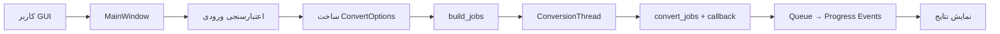

<dev dir="rtl">

# پیشنهاد رابط کاربری گرافیکی (GUI) برای fa-md-pdf

## خلاصه

این مستند پیشنهاد افزودن یک رابط کاربری گرافیکی (GUI) به پروژه fa-md-pdf را ارائه می‌دهد. هدف این است که تمام قابلیت‌های موجود در CLI از طریق یک رابط بصری نیز در دسترس باشد، بدون اینکه عملکرد CLI تغییر کند.

---

## انگیزه

- کاربرانی که با خط فرمان آشنا نیستند بتوانند از ابزار استفاده کنند
- انتخاب فایل و فولدر با دیالوگ بصری ساده‌تر است
- مشاهده پیشرفت تبدیل دسته‌ای به‌صورت زنده
- تنظیم گزینه‌ها بدون نیاز به حفظ کردن پرچم‌های CLI

---

## اصول طراحی

| اصل | توضیح |
|-----|-------|
| حفظ CLI | رابط خط فرمان بدون تغییر باقی می‌ماند |
| آفلاین | GUI مانند CLI بدون اینترنت کار می‌کند |
| وابستگی حداقلی | از tkinter (کتابخانه استاندارد پایتون) استفاده می‌شود |
| استفاده مجدد | هسته تبدیل (converter.py) مشترک بین CLI و GUI است |
| فارسی/RTL | رابط کاربری راست‌به‌چپ با برچسب‌های فارسی |

---

## انتخاب ابزار GUI: tkinter

### چرا tkinter؟

- **بدون وابستگی اضافی:** جزء کتابخانه استاندارد پایتون است و نیازی به `pip install` ندارد
- **سازگار با آفلاین:** نیازی به دانلود چیزی ندارد
- **سبک و سریع:** برای یک ابزار تبدیل فایل، tkinter کاملاً کافی است
- **پشتیبانی از RTL:** با تنظیمات مناسب، متن فارسی را به‌درستی نمایش می‌دهد
- **پایداری:** سال‌هاست که بخشی از پایتون است و به‌خوبی نگهداری می‌شود

### گزینه‌های بررسی‌شده و رد شده

| گزینه | دلیل رد |
|-------|---------|
| PyQt6 / PySide6 | وابستگی سنگین (~100MB)، مغایر با فلسفه حداقلی پروژه |
| wxPython | نیاز به کامپایل C++، نصب پیچیده |
| Kivy | طراحی‌شده برای موبایل، بیش از حد برای این کاربرد |
| Dear PyGui | وابستگی خارجی، جامعه کوچک‌تر |

---

## نحوه اجرا

### دو روش راه‌اندازی GUI

```powershell
# روش ۱: از طریق پرچم --gui
fa-md-pdf --gui

# روش ۲: دستور مستقیم
fa-md-pdf-gui
```

### CLI بدون تغییر

```powershell
# همه دستورات قبلی دقیقاً مثل قبل کار می‌کنند
fa-md-pdf .\docs
fa-md-pdf .\docs -o .\pdf --verbose
```

---

## طرح رابط کاربری

```text
┌─────────────────────────────────────────────────────────┐
│  fa-md-pdf - تبدیل مارک‌داون به PDF                      │
├─────────────────────────────────────────────────────────┤
│                                                         │
│  ── ورودی ────────────────────────────────────────────  │
│  [مسیر فایل یا فولدر ▯▯▯▯▯▯▯▯▯▯] [انتخاب فایل] [انتخاب فولدر] │
│  ☑ جستجوی بازگشتی در زیرپوشه‌ها                         │
│                                                         │
│  ── خروجی ───────────────────────────────────────────  │
│  [مسیر خروجی (اختیاری) ▯▯▯▯▯▯▯▯] [انتخاب...]          │
│                                                         │
│  ── تنظیمات ─────────────────────────────────────────  │
│  ┌─ صفحه ─┬─ فونت ─┬─ Mermaid ─┬─ پیشرفته ─┐          │
│  │                                           │          │
│  │  فرمت صفحه: [A4 ▾]                       │          │
│  │  حاشیه:    [15mm  ]                      │          │
│  │  ☐ خروجی افقی (Landscape)                 │          │
│  │                                           │          │
│  └───────────────────────────────────────────┘          │
│                                                         │
│  [🔄 تبدیل]                        [⏹ انصراف]          │
│                                                         │
│  ── نتایج ───────────────────────────────────────────  │
│  ┌─────────────────────────────────────────────────┐   │
│  │ ✓ docs\intro.md → docs\intro.pdf                │   │
│  │ ✓ docs\guide.md → docs\guide.pdf                │   │
│  │ ✗ docs\broken.md - خطا: Mermaid timeout         │   │
│  │                                                  │   │
│  │ نتیجه: ۲ موفق، ۱ ناموفق                         │   │
│  └─────────────────────────────────────────────────┘   │
│                                                         │
└─────────────────────────────────────────────────────────┘
```

---

## تب‌های تنظیمات

### تب صفحه
| عنصر | نوع | پیش‌فرض |
|------|-----|---------|
| فرمت صفحه | Dropdown (A4, Letter, Legal) | A4 |
| حاشیه | Text field | 15mm |
| خروجی افقی | Checkbox | غیرفعال |

### تب فونت
| عنصر | نوع | پیش‌فرض |
|------|-----|---------|
| خانواده فونت | Text field (فقط خواندنی) | Vazirmatn fallback stack |
| فایل فونت | File picker (.ttf) | - |
| فولدر فونت‌ها | Directory picker | fonts/ (اگر وجود داشته باشد) |

> نکته: انتخاب فایل فونت، فولدر فونت را غیرفعال می‌کند (مانند CLI).

### تب Mermaid
| عنصر | نوع | پیش‌فرض |
|------|-----|---------|
| فایل Mermaid JS | File picker | vendor/mermaid.min.js |
| تم | Dropdown (default, base, dark, forest, neutral, null) | default |
| Timeout (ms) | Numeric field | 30000 |
| نادیده گرفتن خطاها | Checkbox | غیرفعال |
| URL (اختیاری) | Text field | خالی |

### تب پیشرفته
| عنصر | نوع | پیش‌فرض |
|------|-----|---------|
| پسوندهای مجاز | Text field | .md .markdown |
| نگه‌داشتن HTML | Checkbox | غیرفعال |
| توقف با اولین خطا | Checkbox | غیرفعال |
| مسیر مرورگرها | Directory picker | browsers/ (اگر وجود داشته باشد) |

---

## معماری فنی

### ساختار ماژول‌ها

```text
src/fa_md_pdf/
  gui.py              ← ماژول جدید GUI
  cli.py              ← افزودن --gui flag
  converter.py        ← افزودن on_progress callback
  defaults.py         ← بدون تغییر
  html_builder.py     ← بدون تغییر
  assets/default.css  ← بدون تغییر
```

### جریان داده



### مدل Threading

- **Main Thread:** رابط کاربری tkinter (event loop)
- **Worker Thread:** اجرای تبدیل با Playwright
- **ارتباط:** `queue.Queue` برای ارسال رویدادهای پیشرفت
- **لغو:** `threading.Event` برای توقف بین jobها
- **به‌روزرسانی UI:** `root.after(100ms)` برای poll کردن صف

### تغییرات در converter.py

افزودن پارامتر اختیاری `on_progress` به تابع `convert_jobs`:

```python
def convert_jobs(
    jobs, options, fail_fast=False,
    on_progress=None  # ← جدید، اختیاری
):
    ...
    # بعد از هر job:
    if on_progress:
        on_progress(job, result.ok, result.error)
```

CLI بدون تغییر کار می‌کند چون callback را نمی‌فرستد.

---

## مدیریت خطا

| خطا | رفتار GUI |
|-----|-----------|
| مرورگر Chromium پیدا نشد | دیالوگ خطا با راهنمای نصب |
| mermaid.min.js پیدا نشد | دیالوگ خطا با مسیر مورد انتظار |
| مسیر ورودی نامعتبر | پیام خطای قرمز کنار فیلد |
| خطا در تبدیل یک فایل | نمایش در لاگ پیشرفت، ادامه بقیه |
| خطای غیرمنتظره | نمایش در لاگ بدون crash برنامه |

---

## تغییرات pyproject.toml

```toml
[project.scripts]
fa-md-pdf = "fa_md_pdf.cli:main"
fa-md-pdf-gui = "fa_md_pdf.gui:main"    # ← جدید
```

---

## تشخیص خودکار دارایی‌ها

هنگام باز شدن GUI، برنامه به‌صورت خودکار:

1. `find_project_root()` را صدا می‌زند
2. اگر `browsers/` وجود داشته باشد → فیلد مسیر مرورگر را پر می‌کند
3. اگر `vendor/mermaid.min.js` وجود داشته باشد → فیلد Mermaid را پر می‌کند
4. اگر `fonts/` وجود داشته باشد → فیلد فولدر فونت را پر می‌کند

---

## مراحل پیاده‌سازی

| مرحله | شرح | فایل‌ها |
|-------|------|---------|
| 1 | افزودن callback به converter.py | converter.py |
| 2 | افزودن --gui به CLI | cli.py |
| 3 | ساخت MainWindow پایه | gui.py |
| 4 | پنل ورودی | gui.py |
| 5 | پنل خروجی | gui.py |
| 6 | تب‌های تنظیمات | gui.py |
| 7 | Thread تبدیل و نمایش پیشرفت | gui.py |
| 8 | دکمه‌های تبدیل/انصراف | gui.py |
| 9 | مدیریت خطا | gui.py |
| 10 | Entry point در pyproject.toml | pyproject.toml |
| 11 | تشخیص خودکار دارایی‌ها | gui.py |

---

## سازگاری

- **Python:** 3.11+ (مانند CLI)
- **سیستم‌عامل:** Windows (هدف اصلی)
- **وابستگی جدید:** هیچ (tkinter جزء پایتون است)
- **CLI:** بدون تغییر رفتار

---

## نتیجه‌گیری

این پیشنهاد یک GUI سبک و کاربردی با tkinter ارائه می‌دهد که:
- هیچ وابستگی جدیدی اضافه نمی‌کند
- CLI را دست‌نخورده نگه می‌دارد
- تمام قابلیت‌های CLI را پوشش می‌دهد
- با فلسفه آفلاین پروژه سازگار است
- رابط فارسی/RTL دارد
