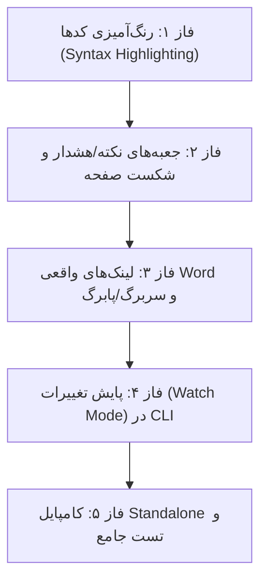

# طرح جامع پیاده‌سازی قابلیت‌های جدید fa-md-pdf

> **برای دستیارهای هوشمند و توسعه‌دهندگان:** این طرح بر اساس متدولوژی توسعه گام‌به‌گام، آزمون‌محور (TDD) و تغییرات ماژولار تدوین شده است. هر فاز دارای تست‌های مستقل، تغییرات مشخص و معیارهای پذیرش است.

**هدف کلی:** ارتقای سطح کیفی اسناد خروجی (PDF و DOCX) به استانداردهای بین‌المللی مستندسازی سازمانی از طریق افزودن ویژگی‌های پیشرفته رندرینگ، رنگ‌آمیزی کدها، پشتیبانی از هدر/فوتر داینامیک، جعبه‌های اخطار/نکته (Callouts)، و ابزارهای اتوماسیون.

---

## User Review Required
> [!IMPORTANT]
> - **وابستگی‌های جدید (Dependencies):** برای رنگ‌آمیزی کدهای برنامه‌نویسی در فاز ۱ به کتابخانه سبک `pygments` (بدون وابستگی خارجی سنگین) نیاز است که در فایل‌های اجرایی Standalone نیز به صورت درونی بیلد خواهد شد.
> - **اولویت‌بندی فازها:** پیاده‌سازی در ۵ فاز متوالی پیشنهاد شده تا پس از اتمام هر فاز، تست و اعتبارسنجی صورت گیرد.

---

## Open Questions
> [!NOTE]
> آیا مایلید همه فازها به ترتیب در یک جریان پیوسته پیاده شوند، یا اولویت خاصی (مثلاً رنگ‌آمیزی کدها + باکس‌های اخطار در فاز اول) مد نظرتان است؟

---

## ساختار فازبندی پیاده‌سازی (Phased Roadmap)



---

## فاز ۱: رنگ‌آمیزی کلمات کلیدی کدها (Syntax Highlighting) برای PDF و DOCX

### هدف:
نمایش کدهای برنامه‌نویسی (SQL, Python, PL/SQL, Bash, JSON, ...) به صورت رنگ‌آمیزی‌شده و استاندارد به جای بلوک متنی تک‌رنگ، هم در PDF و هم در Word.

### فایل‌های تحت تغییر:
1. `pyproject.toml` و `requirements.txt`: افزودن `pygments>=2.17,<3`
2. `src/fa_md_pdf/html_builder.py`: اتصال Pygments به موتور Markdown برای خروجی HTML/PDF.
3. `src/fa_md_pdf/assets/default.css`: افزودن تم رنگی مدرن و خوانا (سازگار با زمینه روشن/کاغذی).
4. `src/fa_md_pdf/docx_builder.py`: تجزیه توکن‌های کدهای برنامه‌نویسی با Lexer پایتون و درج کلمات به صورت Runهای رنگی استاندارد OpenXML.
5. `tests/test_syntax_highlighting.py`: تست واحد برای اعتبارسنجی رنگ‌آمیزی زبان‌های مختلف.

### جزئیات طراحی فنی:
- در **HTML/PDF**: با استفاده از فرمتر Pygments، کدهای داخل ` ```sql ` با کلاس‌های CSS تبدیل می‌شوند.
- در **DOCX**: از تابع `pygments.lex(code, lexer)` استفاده می‌شود؛ هر توکن (Keyword, String, Comment, Number) با رنگ RGB متناظر خود (مثلا آبی برای کلمات کلیدی، سبز برای رشته‌ها، خاکستری برای کامنت‌ها) به عنوان یک Run مستقل در پاراگراف کد درج می‌شود (با حفظ کامل ویژگی LTR).

---

## فاز ۲: جعبه‌های پیام و هشدار (Callout / Admonitions) و شکست صفحه (Page Break)

### هدف:
۱. پشتیبانی از سینتکس استاندارد گیت‌هاب برای کادرهای توجه و هشدار:
```markdown
> [!NOTE]
> متن نکته

> [!WARNING]
> متن هشدار مهم

> [!TIP]
> راهنمای فنی
```
۲. پشتیبانی از دستور شکست صفحه دستی (`<!-- pagebreak -->` یا `\pagebreak`).

### فایل‌های تحت تغییر:
1. `src/fa_md_pdf/html_builder.py`: شناسایی الگوی Blockquoteهای Alert و تبدیل به باکس‌های استایل‌دار.
2. `src/fa_md_pdf/assets/default.css`: تعریف استایل‌های شکیل برای ۵ نوع هشدار (Note=آبی، Tip=سبز، Important=بنفش، Warning=نارنجی، Caution=قرمز) با آیکون‌های SVG درون‌خطی.
3. `src/fa_md_pdf/docx_builder.py`: ایجاد Callout Box در Word با حاشیه رنگی ضخیم در سمت راست، رنگ پس‌زمینه محو و عنوان پررنگ.
4. اضافه کردن شکست صفحه در DOCX: افزودن دستور `document.add_page_break()` هنگام رسیدن به توکن شکست صفحه.

---

## فاز ۳: هایپرلینک‌های واقعی در Word و سربرگ/پابرگ داینامیک

### هدف:
۱. در Word: تبدیل لینک‌های متنی Markdown به هایپرلینک‌های قابل کلیک واقعی (`w:hyperlink`) که کاربر با Ctrl+Click بتواند مستقیماً به آدرس یا فایل دسترسی داشته باشد.
۲. در PDF و Word: افزودن شماره صفحه داینامیک (صفحه X از Y) و عنوان سند در هدر و فوتر.

### فایل‌های تحت تغییر:
1. `src/fa_md_pdf/docx_builder.py`: ساخت تگ‌های رابطه OpenXML (`r:id`) و المان‌های `<w:hyperlink>` در پاراگراف‌های Word.
2. تنظیم Header & Footer در Word: درج فیلدهای استاندارد `PAGE` و `NUMPAGES` در فوتر سند Word با چینش متمرکز یا چپ‌چین.
3. تنظیم Header & Footer در PDF (`converter.py`): استفاده از قابلیت `display_header_footer=True` در Playwright با تمپلیت‌های HTML فارسی و متغیرهای `pageNumber` و `totalPages`.

---

## فاز ۴: قابلیت پایش تغییرات (Watch Mode) در ابزار خط فرمان (CLI)

### هدف:
امکان اجرای برنامه با سوییچ `--watch`:
```powershell
fa-md-pdf .\docs --watch
```
برنامه در پس‌زمینه اجرا مانده و با هر بار ویرایش و ذخیره فایل‌های Markdown، خروجی‌های PDF یا DOCX را به صورت آنی و خودکار کامپایل می‌کند (بسیار کاربردی در حین نوشتن مستندات).

### فایل‌های تحت تغییر:
1. `src/fa_md_pdf/cli.py`: افزودن آرگومان `--watch`.
2. `src/fa_md_pdf/watcher.py` [NEW]: ماژول سبک پایش رویدادهای فایل‌ها با بازه بررسی هوشمند (Debounce) برای جلوگیری از بیلد تکراری حین ذخیره‌سازی.

---

## فاز ۵: تست‌های جامع، کامپایل Standalone و انتشار نسخه جدید

### اقدامات اجرایی:
1. نگارش تست‌های جامع در پوشه `tests/` و اطمینان از پاس شدن ۱۰۰٪ تست‌ها با `pytest`.
2. تست تبدیل فایل‌های نمونه پیچیده (شامل گزارش‌های پایان روز بانکی، کدهای PL/SQL، دیاگرام‌های Mermaid و جداول).
3. بیلد مجدد فایل‌های اجرایی پرتابل:
   - `dist/fa-md-pdf.exe`
   - `dist/fa-md-pdf-gui.exe`
4. فشرده‌سازی و به‌روزرسانی پکیج توزیع پروداکشن:
   - `dist/fa-md-pdf-standalone.zip`
5. ثبت و به‌روزرسانی مستندات پروژه در `CHANGELOG.md` و `README.md`.

---

## برنامه راستی‌آزمایی (Verification Plan)

### آزمون‌های خودکار:
```powershell
# اجرای تست‌های جامع
.\.venv\Scripts\pytest -v

# تست بیلد پکیج اجرایی
.\scripts\build-exe.ps1
```

### اعتبارسنجی چشمی و عملیاتی:
1. تبدیل فایل گزارش معماری نمونه (`BRANCH_BASED_PARALLEL_EOD_FEASIBILITY_REPORT.md`) به دو فرمت PDF و DOCX.
2. بررسی رنگ‌آمیزی کدهای SQL در Word و PDF.
3. بررسی کادرهای Callout و شماره صفحات در Word و PDF.
4. بررسی کارکرد سوییچ `--watch` در ترمینال.
