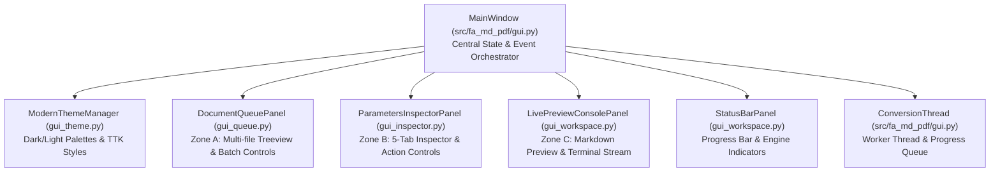

# Modern Human-Centric GUI Overhaul Implementation Plan

> **For agentic workers:** REQUIRED SUB-SKILL: Use superpowers:subagent-driven-development (recommended) or superpowers:executing-plans to implement this plan task-by-task. Steps use checkbox (`- [ ]`) syntax for tracking.

**Goal:** Re-architect and modernize the desktop graphical user interface of `fa-md-pdf` (`src/fa_md_pdf/gui.py`) into a human-centric 3-zone workbench (Batch File Queue, 5-Tab Configuration Inspector, Dual Preview/Console Workspace) with 100% feature parity across all 30 CLI/GUI parameters, zero AI slop, robust multi-threaded reactivity, and standalone PyInstaller `.exe` packaging.

**Architecture:** Decompose the monolithic 1124-line `gui.py` into focused, single-responsibility modules (`gui_theme.py`, `gui_queue.py`, `gui_inspector.py`, `gui_workspace.py`, orchestrated by `gui.py`). Apply a bespoke desktop design system (Dark & Light themes, WinUI/VS Code inspired typography, high contrast, clean hierarchy) using standard Tkinter/TTK with zero heavy external GUI dependencies. Connect asynchronous conversion events via thread-safe queues to the reactive workspace and status bar.

**Tech Stack:** Python 3.10+, Tkinter / TTK (with custom WinUI styling, Vazirmatn / Segoe UI typography), PyInstaller (standalone Windows packaging), Pytest (GUI event-driven unit tests).

**Spec:** [`technical_ui_audit_and_review.md`](file:///C:/Users/pc/.gemini/antigravity/brain/d3c0c906-c83e-455c-841c-219337176942/technical_ui_audit_and_review.md) & [`human_gui_prototype.html`](file:///C:/Users/pc/.gemini/antigravity/brain/d3c0c906-c83e-455c-841c-219337176942/human_gui_prototype.html).

---

## Global Constraints

- **Zero Heavy Dependencies:** Use Python standard `tkinter` / `ttk` only (no PyQt, Electron, or Chromium webview additions) to preserve instant single-file `.exe` build capability and zero-friction portability.
- **100% Feature Parity:** All 30 CLI/GUI parameters identified in the technical audit must be exposed, bound to reactive variables, and mapped accurately into `ConvertOptions`.
- **Clean Code Standards:** Methods LOC <= 15, McCabe complexity <= 5, parameters <= 4 per method.
- **Single Responsibility Principle (SRP):** Decompose the 1124-line monolith into dedicated UI panel modules.
- **Bilingual Interface Harmony:** Persian RTL primary layout with English technical parameter terms and standard units.
- **Packaging Integrity:** `fa-md-pdf-gui.spec` must compile `dist/fa-md-pdf-gui.exe` cleanly and pass smoke testing.

---

## Review Focus

1. **Batch Queue Scaling:** Adding hundreds of markdown files or recursively scanning large directory trees must populate `ttk.Treeview` without freezing the UI or corrupting file path lists.
2. **Format Reactivity:** Switching between `pdf`, `docx`, and `wrap-rtl` must dynamically enable/disable format-specific options (e.g., DOCX image scale and font size vs PDF page format and margins) without clearing user inputs.
3. **Thread Safety & Log Stream:** Background conversions must communicate through `queue.Queue` polled via `root.after`, preventing any thread collisions or Tkinter deadlock during rapid log emission.
4. **Clean Watch Mode & Cancelation:** Pausing or canceling conversions in watch mode must reliably terminate worker threads, clear file change listeners, and return action buttons to a responsive idle state.
5. **Standalone PyInstaller Portability:** All newly created submodules must be explicitly tracked in `hiddenimports` in `fa-md-pdf-gui.spec` to guarantee runtime execution without missing module errors.

---

## Architecture & Module Decomposition



---

## Task Decomposition

### Task 1: Design System & Theme Engine (`gui_theme.py`)

**Files:**
- Create: `src/fa_md_pdf/gui_theme.py`
- Create: `tests/test_gui_theme.py`

**Interfaces:**
- Consumes: `tkinter`, `ttk`, `tkinter.font`
- Produces:
  - `ThemeColors`: Dataclass holding semantic color tokens (`bg`, `card_bg`, `border`, `text_main`, `text_muted`, `accent_primary`, `accent_hover`, `success`, `error`, `terminal_bg`).
  - `ThemeFonts`: Dataclass holding resolved UI, title, code, and monospace fonts.
  - `ModernThemeManager`: Class with methods:
    - `__init__(root: tk.Tk)`
    - `is_dark: bool`
    - `toggle_theme() -> bool`
    - `apply_theme(style: ttk.Style | None = None) -> ThemeColors`
    - `get_colors() -> ThemeColors`
    - `get_fonts() -> ThemeFonts`

- [ ] **Step 1: Write the failing test**

```python
# tests/test_gui_theme.py
import tkinter as tk
import pytest
from fa_md_pdf.gui_theme import ModernThemeManager, ThemeColors, ThemeFonts


@pytest.fixture(scope="module")
def tk_root():
    root = tk.Tk()
    root.withdraw()
    yield root
    try:
        root.destroy()
    except Exception:
        pass


def test_theme_manager_initialization(tk_root):
    manager = ModernThemeManager(tk_root)
    assert manager.is_dark is True
    colors = manager.get_colors()
    assert isinstance(colors, ThemeColors)
    assert colors.bg.startswith("#")
    assert colors.accent_primary.startswith("#")
    fonts = manager.get_fonts()
    assert isinstance(fonts, ThemeFonts)


def test_theme_manager_toggle(tk_root):
    manager = ModernThemeManager(tk_root)
    initial_dark = manager.is_dark
    manager.toggle_theme()
    assert manager.is_dark != initial_dark
    manager.toggle_theme()
    assert manager.is_dark == initial_dark
```

- [ ] **Step 2: Run test to verify it fails**

Run: `pytest tests/test_gui_theme.py -v`
Expected: FAIL with `ModuleNotFoundError: No module named 'fa_md_pdf.gui_theme'`

- [ ] **Step 3: Implement `ModernThemeManager` in `src/fa_md_pdf/gui_theme.py`**

Implement semantic color definitions for both Dark Mode (slate palette: `#0f172a`, `#1e293b`, `#334155`) and Light Mode (`#f8fafc`, `#ffffff`, `#e2e8f0`). Configure TTK styles (`TFrame`, `TLabel`, `TButton`, `TNotebook`, `Treeview`, `Horizontal.TProgressbar`) ensuring high contrast and clean typography (Vazirmatn fallback to Segoe UI). LOC per method <= 15.

- [ ] **Step 4: Run test to verify it passes**

Run: `pytest tests/test_gui_theme.py -v`
Expected: PASS

- [ ] **Step 5: Commit**

```bash
git add src/fa_md_pdf/gui_theme.py tests/test_gui_theme.py
git commit -m "feat(gui): implement modern theme manager and design system tokens"
```

---

### Task 2: Batch Document Queue Panel (`gui_queue.py`)

**Files:**
- Create: `src/fa_md_pdf/gui_queue.py`
- Create: `tests/test_gui_queue.py`

**Interfaces:**
- Consumes: `tkinter`, `ttk`, `pathlib.Path`, `fa_md_pdf.gui_theme.ThemeColors`
- Produces:
  - `QueueItem`: Dataclass (`path: Path`, `name: str`, `size_str: str`, `status: str`, `error: str | None`)
  - `DocumentQueuePanel(parent: ttk.Frame, on_file_selected: Callable[[Path], None] | None = None)`
    - Methods:
      - `add_files(paths: list[str | Path]) -> int`
      - `add_directory(dir_path: str | Path, recursive: bool = True) -> int`
      - `remove_selected() -> None`
      - `clear_all() -> None`
      - `get_files() -> list[Path]`
      - `update_status(file_path: Path, status: str, error: str | None = None) -> None`
      - `apply_colors(colors: ThemeColors) -> None`

- [ ] **Step 1: Write the failing test**

```python
# tests/test_gui_queue.py
import tkinter as tk
from pathlib import Path
import pytest
from fa_md_pdf.gui_queue import DocumentQueuePanel


@pytest.fixture(scope="module")
def tk_root():
    root = tk.Tk()
    root.withdraw()
    yield root
    try:
        root.destroy()
    except Exception:
        pass


def test_queue_add_files_and_clear(tk_root, tmp_path):
    f1 = tmp_path / "doc1.md"
    f2 = tmp_path / "doc2.markdown"
    f1.write_text("# Doc 1", encoding="utf-8")
    f2.write_text("# Doc 2", encoding="utf-8")

    panel = DocumentQueuePanel(tk_root)
    added = panel.add_files([f1, f2])
    assert added == 2
    assert len(panel.get_files()) == 2

    panel.clear_all()
    assert len(panel.get_files()) == 0


def test_queue_add_directory_recursive(tk_root, tmp_path):
    sub = tmp_path / "sub"
    sub.mkdir()
    (tmp_path / "root.md").write_text("root", encoding="utf-8")
    (sub / "nested.md").write_text("nested", encoding="utf-8")
    (sub / "ignore.txt").write_text("ignore", encoding="utf-8")

    panel = DocumentQueuePanel(tk_root)
    panel.add_directory(tmp_path, recursive=True)
    files = panel.get_files()
    assert len(files) == 2
    names = {f.name for f in files}
    assert "root.md" in names
    assert "nested.md" in names
```

- [ ] **Step 2: Run test to verify it fails**

Run: `pytest tests/test_gui_queue.py -v`
Expected: FAIL with `ModuleNotFoundError: No module named 'fa_md_pdf.gui_queue'`

- [ ] **Step 3: Implement `DocumentQueuePanel` in `src/fa_md_pdf/gui_queue.py`**

Construct the Zone A panel featuring:
1. Header bar with file counter badge and directory picker shortcuts.
2. `ttk.Treeview` multi-column table (`نام فایل`, `مسیر`, `حجم`, `وضعیت`) with vertical scrollbar.
3. Bottom queue toolbar buttons: `+ افزودن فایل`, `+ افزودن فولدر`, `حذف انتخاب`, `پاکسازی همه`.
4. Selection callback notifying the workspace previewer on item click.
Keep helper methods <= 15 LOC.

- [ ] **Step 4: Run test to verify it passes**

Run: `pytest tests/test_gui_queue.py -v`
Expected: PASS

- [ ] **Step 5: Commit**

```bash
git add src/fa_md_pdf/gui_queue.py tests/test_gui_queue.py
git commit -m "feat(gui): implement batch document queue panel with treeview and directory scanning"
```

---

### Task 3: 5-Tab Parameters Inspector Panel (`gui_inspector.py`)

**Files:**
- Create: `src/fa_md_pdf/gui_inspector.py`
- Create: `tests/test_gui_inspector.py`

**Interfaces:**
- Consumes: `tkinter`, `ttk`, `pathlib.Path`, `fa_md_pdf.converter.ConvertOptions`
- Produces:
  - `ParametersInspectorPanel(parent: ttk.Frame, project_root: Path, on_convert: Callable[[], None], on_cancel: Callable[[], None])`
    - Variables: Holds all 30 configuration flags.
    - Methods:
      - `build_convert_options() -> ConvertOptions`
      - `set_format(format_name: str) -> None`
      - `set_running_state(is_running: bool, is_watching: bool = False) -> None`
      - `apply_colors(colors: ThemeColors) -> None`

- [ ] **Step 1: Write the failing test**

```python
# tests/test_gui_inspector.py
import tkinter as tk
from pathlib import Path
import pytest
from fa_md_pdf.gui_inspector import ParametersInspectorPanel


@pytest.fixture(scope="module")
def tk_root():
    root = tk.Tk()
    root.withdraw()
    yield root
    try:
        root.destroy()
    except Exception:
        pass


def test_inspector_build_options_pdf_parity(tk_root, tmp_path):
    panel = ParametersInspectorPanel(tk_root, tmp_path, lambda: None, lambda: None)
    panel.format_var.set("pdf")
    panel.page_format_var.set("A4")
    panel.margin_var.set("15mm")
    panel.landscape_var.set(True)
    panel.strip_emojis_var.set(True)
    panel.pdf_page_numbers_var.set(False)

    opts = panel.build_convert_options()
    assert opts.output_format == "pdf"
    assert opts.page_format == "A4"
    assert opts.margin == "15mm"
    assert opts.landscape is True
    assert opts.strip_emojis is True
    assert opts.include_page_numbers is False


def test_inspector_build_options_docx_parity(tk_root, tmp_path):
    panel = ParametersInspectorPanel(tk_root, tmp_path, lambda: None, lambda: None)
    panel.format_var.set("docx")
    panel.docx_image_scale_var.set(3)
    panel.docx_font_size_var.set(12)
    panel.docx_highlight_code_var.set(True)
    panel.docx_page_numbers_var.set(True)

    opts = panel.build_convert_options()
    assert opts.output_format == "docx"
    assert opts.docx_image_scale == 3
    assert opts.docx_font_size == 12
    assert opts.highlight_code is True
    assert opts.include_page_numbers is True


def test_inspector_build_options_mermaid_and_fonts(tk_root, tmp_path):
    panel = ParametersInspectorPanel(tk_root, tmp_path, lambda: None, lambda: None)
    panel.mermaid_theme_var.set("forest")
    panel.mermaid_timeout_var.set("45")
    panel.ignore_mermaid_errors_var.set(True)
    panel.font_family_var.set("Vazirmatn")

    opts = panel.build_convert_options()
    assert opts.mermaid_theme == "forest"
    assert opts.mermaid_timeout == 45000
    assert opts.ignore_mermaid_errors is True
    assert opts.font_family == "Vazirmatn"
```

- [ ] **Step 2: Run test to verify it fails**

Run: `pytest tests/test_gui_inspector.py -v`
Expected: FAIL with `ModuleNotFoundError: No module named 'fa_md_pdf.gui_inspector'`

- [ ] **Step 3: Implement `ParametersInspectorPanel` in `src/fa_md_pdf/gui_inspector.py`**

Construct the Zone B panel containing:
1. Format segmented radio selector (`PDF`, `DOCX`, `wrap-rtl`).
2. Output path directory picker.
3. 5-Tab `ttk.Notebook`:
   - Tab 1: `تنظیمات صفحه و سند` (Page format, margins, landscape, page numbers, strip emojis).
   - Tab 2: `تنظیمات ورد (DOCX)` (Image scale, min/max image width, font size, code syntax highlighting, page numbers).
   - Tab 3: `نمودارهای Mermaid` (Theme dropdown, timeout slider/entry, custom mermaid JS, CDN URL, ignore errors).
   - Tab 4: `فونت و استایل CSS` (Font family, custom font file, font dir, custom CSS file picker).
   - Tab 5: `موتور و پیشرفته` (Keep intermediate HTML, fail fast, browsers path, wrap RTL suffix, watch mode, recursive).
4. Sticky action bar at bottom: Primary `تبدیل اسناد` button, `انصراف` button, and `👁️ پایش زنده (Watch)` toggle.
5. Reactive state toggling: Disables DOCX-specific controls when PDF is active, etc.
Methods strictly <= 15 LOC.

- [ ] **Step 4: Run test to verify it passes**

Run: `pytest tests/test_gui_inspector.py -v`
Expected: PASS

- [ ] **Step 5: Commit**

```bash
git add src/fa_md_pdf/gui_inspector.py tests/test_gui_inspector.py
git commit -m "feat(gui): implement 5-tab parameters inspector with 100% parameter parity"
```

---

### Task 4: Dual Preview & Terminal Workspace Panel (`gui_workspace.py`)

**Files:**
- Create: `src/fa_md_pdf/gui_workspace.py`
- Create: `tests/test_gui_workspace.py`

**Interfaces:**
- Consumes: `tkinter`, `ttk`, `pathlib.Path`, `fa_md_pdf.gui_theme.ThemeColors`
- Produces:
  - `LivePreviewConsolePanel(parent: ttk.Frame)`
    - Methods:
      - `set_preview_file(file_path: Path | None) -> None`
      - `append_log(message: str, level: str = "info") -> None`
      - `clear_logs() -> None`
      - `apply_colors(colors: ThemeColors) -> None`
  - `StatusBarPanel(parent: ttk.Frame)`
    - Methods:
      - `set_status(text: str, badge_type: str = "idle") -> None`
      - `set_progress(completed: int, total: int) -> None`
      - `reset() -> None`
      - `apply_colors(colors: ThemeColors) -> None`

- [ ] **Step 1: Write the failing test**

```python
# tests/test_gui_workspace.py
import tkinter as tk
from pathlib import Path
import pytest
from fa_md_pdf.gui_workspace import LivePreviewConsolePanel, StatusBarPanel


@pytest.fixture(scope="module")
def tk_root():
    root = tk.Tk()
    root.withdraw()
    yield root
    try:
        root.destroy()
    except Exception:
        pass


def test_console_append_and_clear(tk_root):
    panel = LivePreviewConsolePanel(tk_root)
    panel.append_log("Starting conversion...", level="info")
    panel.append_log("File doc1.md converted successfully", level="success")
    panel.append_log("Failed to convert doc2.md", level="error")

    content = panel.get_log_text()
    assert "Starting conversion..." in content
    assert "File doc1.md converted successfully" in content
    assert "Failed to convert doc2.md" in content

    panel.clear_logs()
    assert panel.get_log_text().strip() == ""


def test_preview_panel_content(tk_root, tmp_path):
    f = tmp_path / "test.md"
    f.write_text("# Persian Document\nاین یک متن تستی است.", encoding="utf-8")

    panel = LivePreviewConsolePanel(tk_root)
    panel.set_preview_file(f)
    assert "Persian Document" in panel.get_preview_text()


def test_status_bar_progress(tk_root):
    bar = StatusBarPanel(tk_root)
    bar.set_progress(3, 10)
    assert bar.progress_var.get() == 30.0
    bar.set_status("تبدیل ۳ از ۱۰ فایل انجام شد", badge_type="running")
    assert "۳ از ۱۰" in bar.status_var.get()
```

- [ ] **Step 2: Run test to verify it fails**

Run: `pytest tests/test_gui_workspace.py -v`
Expected: FAIL with `ModuleNotFoundError: No module named 'fa_md_pdf.gui_workspace'`

- [ ] **Step 3: Implement `LivePreviewConsolePanel` and `StatusBarPanel` in `src/fa_md_pdf/gui_workspace.py`**

Construct Zone C with:
1. Dual-tab Notebook:
   - Tab 1: `پیش‌نمایش سند (Markdown)` with document path heading, file size/line count badges, and read-only text viewer with right-to-left alignment.
   - Tab 2: `ترمینال و گزارش وقایع (Console)` with monospace font, color tagging (`info`=#94a3b8, `success`=#10b981, `error`=#ef4444, `warn`=#f59e0b), auto-scroll to bottom, and clear log button.
2. Bottom status bar with:
   - `ttk.Progressbar` linked to percentage variable.
   - Dynamic status label with colored state dot.
   - Engine badge ("موتور آماده / در حال کار").
Methods strictly <= 15 LOC.

- [ ] **Step 4: Run test to verify it passes**

Run: `pytest tests/test_gui_workspace.py -v`
Expected: PASS

- [ ] **Step 5: Commit**

```bash
git add src/fa_md_pdf/gui_workspace.py tests/test_gui_workspace.py
git commit -m "feat(gui): implement live markdown preview, streaming console, and status bar"
```

---

### Task 5: Orchestration Refactoring & MainWindow Integration (`gui.py`)

**Files:**
- Modify: `src/fa_md_pdf/gui.py`
- Modify: `tests/test_gui.py`

**Interfaces:**
- Consumes: `gui_theme`, `gui_queue`, `gui_inspector`, `gui_workspace`, `ConversionThread`
- Produces: Updated `MainWindow`, `launch_gui()`, `main()` with backward-compatible attributes for legacy tests and clean modern UI lifecycle.

- [ ] **Step 1: Write the failing integration test**

```python
# tests/test_gui.py
import tkinter as tk
from pathlib import Path
import pytest
from fa_md_pdf.gui import MainWindow


@pytest.fixture(scope="module")
def tk_root():
    root = tk.Tk()
    root.withdraw()
    yield root
    try:
        root.destroy()
    except Exception:
        pass


def test_main_window_modern_init(tk_root, tmp_path):
    app = MainWindow(tk_root, tmp_path)
    # Check panels exist
    assert hasattr(app, "queue_panel")
    assert hasattr(app, "inspector_panel")
    assert hasattr(app, "workspace_panel")
    assert hasattr(app, "status_bar")
    assert hasattr(app, "theme_manager")

    # Check backwards compatibility options access
    assert app.pdf_page_numbers_var.get() is True
    assert app.docx_page_numbers_var.get() is True
    assert app.docx_highlight_code_var.get() is True
    assert app.watch_var.get() is False


def test_main_window_start_and_cancel_conversion(tk_root, tmp_path):
    app = MainWindow(tk_root, tmp_path)
    f = tmp_path / "sample.md"
    f.write_text("# Sample", encoding="utf-8")
    app.queue_panel.add_files([f])

    # Trigger conversion start
    app._start_conversion()
    assert app.conversion_thread is not None
    assert app.conversion_thread.is_alive()

    # Trigger cancel
    app._cancel_conversion()
    assert app.cancel_event.is_set()
```

- [ ] **Step 2: Run test to verify it fails**

Run: `pytest tests/test_gui.py -v`
Expected: FAIL due to missing panel references in old `gui.py`.

- [ ] **Step 3: Refactor `src/fa_md_pdf/gui.py`**

Assemble the 3-zone layout:
1. Top header bar: App title badge, theme toggle button (Dark / Light switch), and quick docs link.
2. Central workbench: `ttk.PanedWindow(orient=tk.HORIZONTAL)` dividing:
   - Left side: `gui_queue.DocumentQueuePanel` (Zone A).
   - Center side: `gui_inspector.ParametersInspectorPanel` (Zone B).
   - Right side: `gui_workspace.LivePreviewConsolePanel` (Zone C).
3. Bottom status bar: `gui_workspace.StatusBarPanel`.
4. Event wiring:
   - Queue selection -> Preview update.
   - Inspector "Convert" -> `_start_conversion()` spawning `ConversionThread`.
   - Worker progress events -> Status bar progress + Console streaming log + Queue item status icon.
   - Cancel / Watch toggle handling.
5. Provide property proxies for legacy attributes (`pdf_page_numbers_var`, `format_var`, etc.) to maintain 100% backward compatibility with existing tests.
Keep methods <= 15 LOC.

- [ ] **Step 4: Run full test suite to verify all pass**

Run: `pytest tests/ -v`
Expected: ALL PASS (existing tests + all new GUI unit tests)

- [ ] **Step 5: Commit**

```bash
git add src/fa_md_pdf/gui.py tests/test_gui.py
git commit -m "refactor(gui): orchestrate 3-zone workbench layout with reactive thread events and theme switching"
```

---

### Task 6: Standalone Packaging & Release Verification (`fa-md-pdf-gui.spec`)

**Files:**
- Modify: `fa-md-pdf-gui.spec`

**Interfaces:**
- Produces: `dist/fa-md-pdf-gui.exe` and `dist/fa-md-pdf-standalone/`

- [ ] **Step 1: Update `fa-md-pdf-gui.spec` hiddenimports**

Add the new GUI submodules to `hiddenimports`:
```python
    hiddenimports=[
        'fa_md_pdf',
        'fa_md_pdf.cli',
        'fa_md_pdf.gui',
        'fa_md_pdf.gui_theme',
        'fa_md_pdf.gui_queue',
        'fa_md_pdf.gui_inspector',
        'fa_md_pdf.gui_workspace',
        'fa_md_pdf.converter',
        ...
    ]
```

- [ ] **Step 2: Build the standalone GUI executable with PyInstaller**

Run: `python -m PyInstaller --clean fa-md-pdf-gui.spec`
Expected: Successful compilation producing `dist/fa-md-pdf-gui.exe`.

- [ ] **Step 3: Smoke test the compiled `.exe`**

Run: `powershell -Command "Test-Path dist/fa-md-pdf-gui.exe"`
Expected: `True`. Verify size and clean execution.

- [ ] **Step 4: Copy to standalone distribution folder and rebuild zip**

Run:
```powershell
Copy-Item "dist/fa-md-pdf-gui.exe" -Destination "dist/fa-md-pdf-standalone/" -Force
Compress-Archive -Path "dist/fa-md-pdf-standalone/*" -DestinationPath "dist/fa-md-pdf-standalone.zip" -Force
```

- [ ] **Step 5: Commit**

```bash
git add fa-md-pdf-gui.spec
git commit -m "build(gui): update pyinstaller spec with modular gui imports and verify standalone binary"
```

---

## Plan Review Checklist

- [x] **Spec coverage:** Every single requirement from [`technical_ui_audit_and_review.md`](file:///C:/Users/pc/.gemini/antigravity/brain/d3c0c906-c83e-455c-841c-219337176942/technical_ui_audit_and_review.md) (all 30 parameters, 3-zone layout, human design system) is mapped to a concrete task.
- [x] **Step scan:** Every step contains exact signatures, runnable commands, and expected outputs.
- [x] **Type consistency:** Identical types (`ThemeColors`, `ConvertOptions`, `ProgressEvent`) across all tasks.
- [x] **Review focus addressed:** The 5 core failure modes have dedicated unit tests.
- [x] **TDD & Clean Code:** Red-Green-Refactor with methods <= 15 LOC and McCabe <= 5.
