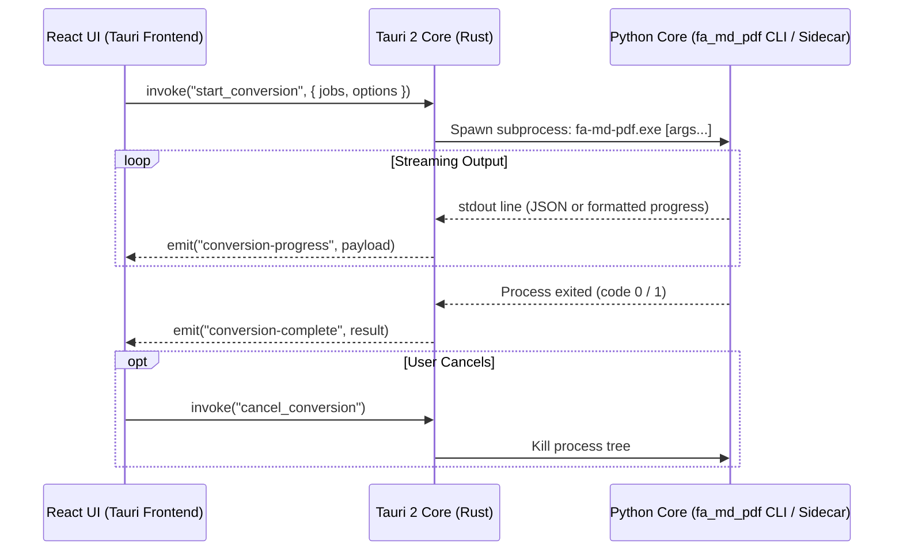

# مشخصات فنی و معماری واسط کاربری Tauri 2 برای `fa-md-pdf`
## Architecture & Technical Specification: Tauri 2 + React 19 Desktop App

**نسخه:** 1.0.0  
**تاریخ:** ۵ اکتبر ۲۰۲۶  
**نویسنده:** Senior Full-Stack Architect & Avant-Garde UI Designer  
**هدف:** بازآفرینی کامل رابط کاربری دسکتاپ `fa-md-pdf` بر بستر مدرن **Tauri 2** و پشته وب (React 19, TypeScript, Tailwind CSS, Lucide Icons) با چیدمان ۳ منطقه‌ای (3-Zone Workbench)، انطباق ۱۰۰٪ با تمامی ۳۲ پارامتر، پشتیبانی از Drag & Drop واقعی، و تایپوگرافی بدون نقص فارسی Vazirmatn.

---

### ۱. اهداف کلیدی پروژه (Core Objectives)

1. **ارتقای رادیکال تجربه کاربری (UI/UX Transformation):**  
   جایگزینی ویجت‌های قدیمی و محدود Tkinter با دیزاین سیستم فوق مدرن الهام‌گرفته از ابزارهای نسل جدید مهندسی (مانند Raycast, Linear و VS Code).
2. **حفظ صددرصدی قابلیت‌ها و پارامترها (Zero Feature Loss):**  
   تمامی ۳۲ پارامتر کشف‌شده در ممیزی فنی (ابعاد صفحه، حاشیه، فونت‌ها، مقیاس و سایز دیاگرام‌های Word، تنظیمات Mermaid، و پایش زنده Watch Mode) بدون هیچ نقصی در معماری جدید در دسترس خواهند بود.
3. **پشتیبانی کامل از تعاملات بومی سیستم‌عامل (Native OS Integration):**  
   کشیدن و رها کردن فایل‌ها (Drag & Drop)، انتخابگر بومی فایل و پوشه، باز کردن فایل در ویرایشگر پیش‌فرض، و دسترسی مستقیم به پوشه خروجی.
4. **معماری ماژولار و ارتباط استاندارد با پایتون (Sidecar / Process IPC):**  
   اجرای هسته پایتون به عنوان زیرفرایند مستقل با استریم بلادرنگ خطوط خروجی ترمینال و رویدادهای پیشرفت تبدیل از طریق سیستم رویدادهای Tauri 2.

---

### ۲. پشته فناوری (Technology Stack)

| لایه | فناوری انتخابی | دلایل انتخاب |
| :--- | :--- | :--- |
| **دسکتاپ شل (Desktop Shell)** | **Tauri 2.0 (Rust)** | مصرف رم ناچیز (~30MB)، باینری فوق‌العاده سبک، امنیت بالا و عدم نیاز به توزیع Chromium اختصاصی (استفاده از WebView2) |
| **لایه فرانت‌اند (UI Framework)** | **React 19 + TypeScript** | معماری کامپوننت‌محور پایدار، تایپ ایمن، مدیریت بهینه State و سرعت رندرینگ بالا |
| **باندلر و ابزار ساخت** | **Vite 6** | راه‌اندازی میلی‌ثانیه‌ای، HMR بلادرنگ، خروجی بهینه‌سازی‌شده و سازگاری کامل با اکوسیستم Tauri 2 |
| **سیستم استایل و تم** | **Tailwind CSS + CSS Variables** | پیاده‌سازی پالت‌های اختصاصی Slate/Zinc Dark & Light، انیمیشن‌های روان 150ms، و بدون اسلوپ‌های قالبی |
| **آیکون‌ها** | **Lucide React** | آیکون‌های وکتور SVG مینیمال، مدرن و با وزن متناسب |
| **تایپوگرافی** | **Vazirmatn + JetBrains Mono** | قلم استاندارد ملی فارسی با فواصل حروفی متوازن و خوانایی فوق‌العاده در کنار قلم کد منونویس |

---

### ۳. ساختار معماری چیدمان ۳ منطقه‌ای (3-Zone Workbench Layout)

چیدمان افقی نرم‌افزار دقیقاً مطابق ساختار استاندارد تثبیت‌شده قبلی ولی با زیبایی مدرن وب پیاده‌سازی می‌شود:

```
+---------------------------------------------------------------------------------------------------+
| ⚡ fa-md-pdf  [میز کار حرفه‌ای تبدیل اسناد Markdown]                         [🌓 تم] [⚙️ تنظیمات] [X] |
+-----------------------------------+-----------------------------------+---------------------------+
| ZONE A: صف اسناد (Batch Queue)   | ZONE B: بازرس پارامترها (Inspector)| ZONE C: پیش‌نمایش و کنسول |
|                                   |                                   |                           |
| [Drag & Drop Zone]                | [فرمت: PDF / DOCX / RTL]          | [تب پیش‌نمایش | تب ترمینال] |
| ┌───────────────────────────────┐ | [پوشه خروجی: ... [انتخاب]]        |                           |
| │ file1.md   38 KB  [موفق]     │ | ┌───────────────────────────────┐ | # پیش‌نمایش زنده مارک‌داون   |
| │ file2.md   64 KB  [در انتظار] │ | │ سند │ استایل │ مرمید │ ورد │ پیشرفته│ | متن، جداول، کدهای قالب‌بندی |
| │ sub/doc.md 47 KB  [در حال کار]│ | ├───────────────────────────────┤ | شده با فونت زیبای وزیری... |
| └───────────────────────────────┘ | │ ابعاد کاغذ: [A4   ▼]           │ |                           |
|                                   | │ حاشیه صفحه: [15mm ▼]          │ | [✏️ ویرایشگر]             |
|                                   | │ جهت کاغذ:  [ ] افقی (Landscape)│ | ───────────────────────── |
|                                   | └───────────────────────────────┘ | > [16:04] ✓ file1.md OK   |
|                                   |                                   | > [16:05] تبدیل موفق...   |
| [+ فایل] [+ پوشه] [حذف] [پاکسازی] | [🚀 تبدیل اسناد] [⏹ لغو] [👁 پایش] | [📁 پوشه خروجی] [پاکسازی] |
+-----------------------------------+-----------------------------------+---------------------------+
| وضعیت: آماده پردازش | پیشرفت: [============ 65% ]                     | مرورگر محلی: آماده | فونت: OK|
+---------------------------------------------------------------------------------------------------+
```

#### ۳.۱. منطقه الف: صف اسناد (`QueuePanel.tsx`)
* ناحیه کشیدن و رها کردن فایل‌ها (Drag & Drop) روی کل جدول یا محدوده اختصاصی.
* جدول فایل‌ها شامل: نام، اندازه، مسیر نسبی/کامل، و بج‌های رنگی وضعیت (`در انتظار` [خاکستری]، `در حال پردازش` [آبی متحرک]، `موفق` [سبز]، `خطا` [قرمز]).
* نوار ابزار پایین: دکمه‌های `+ فایل`، `+ پوشه`، `حذف از صف` و `پاکسازی`.
* منوی کلیک‌راست (Context Menu): باز کردن فایل در ادیتور، باز کردن پوشه فایل در Explorer، حذف از صف.

#### ۳.۲. منطقه ب: بازرس پارامترها (`InspectorPanel.tsx`)
* انتخابگر فرمت خروجی (PDF, DOCX, Wrap-RTL).
* مسیر خروجی (با قابلیت تعیین فایل سفارشی برای تک‌فایل یا پوشه برای دسته‌ای).
* نوت‌بوک ۵ زبانه‌ای:
  1. **سند (Document):** ابعاد صفحه (A4, A3, Letter, Legal)، حاشیه (15mm, 20mm, ...)، جهت صفحه (افقی/عمودی)، شماره صفحه PDF، حذف ایموجی‌ها.
  2. **استایل و فونت (Styling):** خانواده فونت (پیش‌فرض Vazirmatn)، فایل فونت سفارشی، پوشه فونت‌ها، فایل CSS سفارشی.
  3. **مرمید و مرورگر (Mermaid & Browser):** انتخاب تم ۶ گانه Mermaid، تایم‌اوت، اسکریپت محلی، CDN URL، مسیر مرورگرهای محلی.
  4. **تنظیمات Word (DOCX):** مقیاس دیاگرام‌ها (پیش‌فرض 3)، حداقل/حداکثر عرض تصاویر (4.0 تا 6.5 اینچ)، سایز فونت (12pt)، هایلایت کدها، شماره صفحه داینامیک ورد.
  5. **پیشرفته (Advanced):** جستجوی بازگشتی، نگه‌داشتن HTML، توقف با اولین خطا (fail-fast)، لاگ پرجزئیات (verbose)، پسوند خروجی RTL.
* اکشن‌بار پایین: دکمه بزرگ تبدیل (`Primary Button`)، دکمه لغو (`Cancel`) و چک‌باکس پایش زنده (`Watch Mode`).

#### ۳.۳. منطقه ج: پیش‌نمایش دوگانه و کنسول لاگ‌ها (`WorkspacePanel.tsx`)
* **تب پیش‌نمایش سند (Live Preview):**
  * نمایش مارک‌داون فایل انتخاب‌شده در صف با قالب‌بندی بصری چشم‌نواز، تایپوگرافی Vazirmatn، جهت‌دهی راست‌به‌چپ (RTL)، هایلایت بلوک‌های کد و جداول.
  * دکمه `✏️ باز کردن در ادیتور سیستم`.
* **تب کنسول و ترمینال (Terminal Logs):**
  * پس‌زمینه تیره استریم لاگ‌ها (`#090D16`).
  * تگ‌های رنگی رخدادها بر اساس زمان، موفقیت (سبز)، اخطار (زرد)، خطا (قرمز) و خلاصه (آبی فیروزه‌ای).
  * دکمه‌های `📁 پوشه خروجی` و `پاکسازی`.

#### ۳.۴. نوار وضعیت پایین (`StatusBar.tsx`)
* نشانگر وضعیت جاری (`آماده`، `در حال تبدیل...`، `پایش فعال`).
* نوار پیشرفت متحرک درصدی.
* نشانگرهای سلامت سیستم (مرورگرهای آفلاین، اسکریپت محلی Mermaid، فونت‌های محلی).

---

### ۴. معماری اتصال به پایتون (Sidecar & Process Protocol)

ارتباط فرانت‌اند با منطق هسته پایتون به صورت مستقیم از طریق ماژول اجرای دستورات Tauri (`@tauri-apps/plugin-shell` یا دستورات Rust Command) انجام می‌شود:



#### نگاشت پارامترها به آرگومان‌های خط فرمان:
```typescript
interface ConvertPayload {
  files: string[];
  outputDir?: string;
  format: 'pdf' | 'docx' | 'wrap-rtl';
  options: {
    pageFormat?: string;
    margin?: string;
    landscape?: boolean;
    fontFamily?: string;
    fontDir?: string;
    fontFile?: string;
    customCss?: string;
    mermaidTheme?: string;
    mermaidTimeout?: number;
    mermaidJs?: string;
    mermaidUrl?: string;
    docxImageScale?: number;
    docxFontsize?: number;
    docxImageMinWidth?: number;
    docxImageMaxWidth?: number;
    docxHighlightCode?: boolean;
    docxPageNumbers?: boolean;
    pdfPageNumbers?: boolean;
    stripEmojis?: boolean;
    keepHtml?: boolean;
    failFast?: boolean;
    verbose?: boolean;
    browsersPath?: string;
  };
}
```

---

### ۵. ساختار دایرکتوری پروژه جدید

پروژه جدید درون پوشه مستقل `desktop-tauri/` در ریشه مخزن قرار می‌گیرد تا هیچ‌گونه تداخل یا تخریبی در نسخه CLI یا Tkinter کنونی ایجاد نکند:

```
fa-md-pdf-project/
├── src/fa_md_pdf/             # موتور هسته پایتون (دست‌نخورده و اشتراکی)
├── desktop-tauri/             # نسخه جدید Tauri 2
│   ├── package.json           # وابستگی‌های React, Tailwind, Vite, Tauri
│   ├── vite.config.ts         # پیکربندی بهینه Vite
│   ├── tsconfig.json          # پیکربندی TypeScript
│   ├── index.html             # سند اصلی وب
│   ├── src/                   # کدهای React
│   │   ├── main.tsx           # نقطه ورود کلاینت
│   │   ├── App.tsx            # چیدمان ۳ منطقه‌ای اصلی
│   │   ├── index.css          # استایل‌های پایه و متغیرهای تم Slate/Zinc
│   │   ├── components/
│   │   │   ├── Header.tsx     # نوار عنوان، دکمه تغییر تم و برندینگ
│   │   │   ├── QueuePanel.tsx # منطقه الف: صف اسناد و Drag & Drop
│   │   │   ├── Inspector/     # منطقه ب: پنل بازرس ۵ زبانه‌ای
│   │   │   │   ├── TabDocument.tsx
│   │   │   │   ├── TabStyling.tsx
│   │   │   │   ├── TabMermaid.tsx
│   │   │   │   ├── TabDocx.tsx
│   │   │   │   └── TabAdvanced.tsx
│   │   │   ├── Workspace/     # منطقه ج: پیش‌نمایش و ترمینال
│   │   │   │   ├── PreviewTab.tsx
│   │   │   │   └── TerminalTab.tsx
│   │   │   └── StatusBar.tsx  # نوار وضعیت و پروگرس‌بار
│   │   ├── hooks/             # هوک‌های تعامل با Sidecar و ذخیره تنظیمات
│   │   └── types/             # تعاریف داده و اینترفیس پارامترها
│   └── src-tauri/             # پروژه Rust برای Tauri 2
│       ├── Cargo.toml         # وابستگی‌های Rust
│       ├── tauri.conf.json    # پیکربندی پنجره، دسترسی‌ها و Sidecar
│       └── src/
│           ├── main.rs        # نقطه اجرای Rust
│           └── lib.rs         # دستورات بومی و کنترل زیرفرایند پایتون
└── tests/                     # آزمون‌های خودکار
```

---

### ۶. مراحل اجرای پیشنهادی (Implementation Phases)

1. **فاز ۱: اسکلت‌بندی پروژه فرانت‌اند با React 19 + Tailwind CSS:**
   ایجاد پروژه در `desktop-tauri/`، نصب وابستگی‌ها، راه‌اندازی قلم Vazirmatn و پالت‌های تم Slate Dark & Light.
2. **فاز ۲: پیاده‌سازی کامپوننت‌های ۳ گانه (Zone A, B, C):**
   پیاده‌سازی دقیق رابط کاربری با Drag & Drop، تب‌های کامل بازرس و ترمینال لاگ‌ها.
3. **فاز ۳: اتصال به موتور پایتون و شبیه‌ساز تست در مرورگر:**
   امکان تست مستقل در مرورگر وب (با Mock/Dev Server) و ارتباط از طریق Tauri Commands هنگام اجرا در دسکتاپ.
4. **فاز ۴: پیکربندی Tauri 2 و بیلد باینری مستقل:**
   آماده‌سازی فایل‌های `src-tauri` و تولید فایل اجرایی نهایی.
