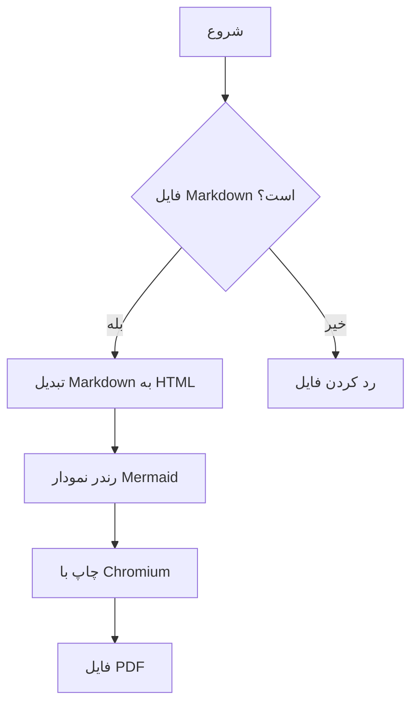

<div dir="rtl">

# نمونه مستند فارسی

</div>

<div dir="rtl">

این یک فایل Markdown نمونه برای تست تبدیل به PDF است. متن فارسی باید راست‌به‌چپ نمایش داده شود و کدها چپ‌به‌راست بمانند.

</div>

<div dir="rtl">

## نمودار Mermaid

</div>



<div dir="rtl">

## جدول

</div>

<div dir="rtl">

| بخش | وضعیت | توضیح |
|---|---:|---|
| فارسی و RTL | خوب | متن راست‌به‌چپ است |
| Mermaid | خوب | داخل مرورگر رندر می‌شود |
| PDF | خوب | با Playwright ساخته می‌شود |

</div>

<div dir="rtl">

## کد

</div>

```python
def hello(name: str) -> str:
    return f"Hello, {name}"
```

<div dir="rtl">

## فهرست

</div>

<div dir="rtl">

1. خواندن فایل Markdown
2. تبدیل به HTML
3. رندر Mermaid
4. تولید PDF

</div>
