# معماری پروژه

## هدف

تبدیل مستندات Markdown فارسی/راست‌به‌چپ، شامل نمودارهای Mermaid، به PDF با یک ابزار CLI قابل استفاده در ویندوز، CI و محیط آفلاین.

## جریان تبدیل

```mermaid
flowchart LR
    A[Markdown File/Folder] --> B[Resolve Offline Defaults]
    B --> C[Read UTF-8/UTF-8-BOM]
    C --> D[Strip Front Matter]
    D --> E[Convert Mermaid Fences to HTML Blocks]
    E --> F[MarkdownIt Render]
    F --> G[RTL HTML Template + Local Fonts]
    G --> H[Chromium via Playwright]
    H --> I[Render Mermaid from Local JS]
    I --> J[Print to PDF]
```



## اجزای اصلی

| فایل | مسئولیت |
|---|---|
| `cli.py` | پارس کردن آرگومان‌های خط فرمان، تشخیص مسیرهای آفلاین، ساخت تنظیمات و اجرای تبدیل |
| `defaults.py` | پیدا کردن ریشه پروژه و مسیرهای پیش‌فرض `browsers`, `fonts`, `vendor/mermaid.min.js` |
| `converter.py` | کشف فایل‌ها، ساخت jobها، اجرای Playwright و تولید PDF |
| `html_builder.py` | تبدیل Markdown به HTML راست‌به‌چپ، تزریق CSS، فونت و Mermaid |
| `assets/default.css` | استایل پایه برای فارسی، RTL، جدول‌ها، code blockها و چاپ |

## تصمیم‌های طراحی

### چرا HTML → PDF؟

برای فارسی و Mermaid، مسیر HTML به PDF در عمل ساده‌تر و قابل کنترل‌تر از LaTeX است. Chromium از CSS، فونت‌های محلی، SVG و جهت راست‌به‌چپ پشتیبانی خوبی دارد.

### چرا Playwright؟

Playwright کنترل مستقیم Chromium را فراهم می‌کند و می‌تواند صفحه HTML را با CSS print به PDF تبدیل کند. در این پروژه، مسیر `browsers/` به‌صورت خودکار به `PLAYWRIGHT_BROWSERS_PATH` وصل می‌شود تا مرورگر از داخل خود پروژه اجرا شود.

### چرا Mermaid داخل مرورگر رندر می‌شود؟

این روش نیاز به نصب Node.js یا Mermaid CLI ندارد. فایل Markdown به HTML تبدیل می‌شود، سپس `vendor/mermaid.min.js` در همان صفحه نمودارها را به SVG تبدیل می‌کند.

### چرا پیش‌فرض آفلاین؟

در محیط‌های مستندسازی داخلی، CI آفلاین یا شبکه‌های محدود، وابستگی به CDN قابل اعتماد نیست. بنابراین پیش‌فرض برنامه این است که این دارایی‌ها در کنار پروژه باشند:

```text
browsers/
fonts/
vendor/mermaid.min.js
```

## محدودیت‌ها

- خود پکیج‌های Python باید از قبل داخل `.venv` نصب شده باشند یا با wheelhouse آفلاین نصب شوند.
- Chromium موجود در `browsers/` باید با نسخه پکیج Pythonِ `playwright` سازگار باشد.
- اگر فایل‌های Markdown به تصویر یا CSS اینترنتی لینک بدهند، در حالت آفلاین بارگذاری نمی‌شوند.
- برخی قابلیت‌های بسیار خاص Markdown ممکن است نیاز به plugin جداگانه داشته باشند.
